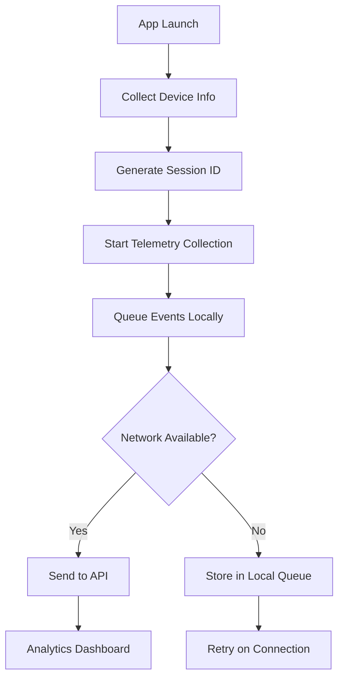

# 📊 CONTEXTO: TELEMETRÍA MÓVIL & ANALYTICS 2025

## 🎯 RESUMEN EJECUTIVO

### Proyecto Actual
- **API**: NestJS con MongoDB/Redis (Backend corriendo localmente)
- **Mobile**: Expo SDK 54 con React Native 0.81.4
- **Arquitectura**: Monorepo con packages separados

### Objetivo
Implementar sistema de telemetría y analytics para recolectar datos esenciales desde la app móvil, incluso antes del login, siguiendo mejores prácticas 2025.

---

## 🔍 HALLAZGOS DE INVESTIGACIÓN

### 1. MEJORES PRÁCTICAS DE TELEMETRÍA MÓVIL 2025

#### **Datos Esenciales a Recolectar (Pre-Login)**
```typescript
interface TelemetryData {
  // Device Information
  deviceInfo: {
    brand: string;           // Apple, Samsung, etc.
    model: string;           // iPhone 15, Galaxy S24, etc.
    osName: string;          // iOS, Android
    osVersion: string;       // 17.2, 14.0, etc.
    appVersion: string;      // 1.0.0
    buildNumber: string;     // 123
    deviceId: string;        // Unique device identifier
    locale: string;          // es-MX, en-US
    timezone: string;        // America/Mexico_City
  };

  // Network & Connectivity
  networkInfo: {
    connectionType: string;  // wifi, cellular, unknown
    carrierName?: string;    // Telcel, AT&T, etc.
    isConnected: boolean;
    networkLatency?: number; // ms
    signalStrength?: number; // -40 to -100 dBm
  };

  // Performance Metrics
  performance: {
    appStartTime: number;    // Time to interactive (ms)
    memoryUsage: number;     // MB
    cpuUsage?: number;       // %
    batteryLevel?: number;   // 0-100%
    isLowPowerMode?: boolean;
    diskUsage?: number;      // Available storage MB
  };

  // User Behavior (Anonymous)
  userSession: {
    sessionId: string;       // UUID for session tracking
    installationId: string;  // First-time install tracking
    launchCount: number;     // App launch counter
    lastActiveDate: Date;
    isFirstLaunch: boolean;
    referralSource?: string; // Deep link source
  };

  // Location & Context
  contextInfo: {
    screenSize: {
      width: number;
      height: number;
      scale: number;
    };
    isTablet: boolean;
    orientation: 'portrait' | 'landscape';
    isDarkMode: boolean;
    accessibility: {
      isScreenReaderEnabled: boolean;
      isReduceMotionEnabled: boolean;
    };
  };
}
```

#### **Principios Clave 2025**
1. **Privacy-First**: Cumplir GDPR/CCPA, datos anónimos por defecto
2. **Real-Time Insights**: Recolección cada 10 minutos vs 4 horas tradicionales
3. **Battery Optimization**: Minimizar impacto en batería y CPU
4. **Segmentation**: Permitir análisis granular por cohortes de usuarios
5. **Offline Support**: Queue de eventos para enviar cuando haya conectividad

---

## 🛠️ COMPATIBILIDAD EXPO SDK 54

### **Librerías Oficiales Disponibles**
```json
{
  "expo-constants": "~18.0.8",      // ✅ App/device constants
  "expo-device": "latest",          // ✅ Device info (agregar)
  "expo-application": "latest",     // ✅ App metadata (agregar)
  "expo-network": "latest",         // ✅ Network status (agregar)
  "expo-battery": "latest",         // ✅ Battery info (agregar)
  "expo-screen-orientation": "latest", // ✅ Orientation (agregar)
  "expo-tracking-transparency": "latest" // ✅ iOS 14+ privacy (agregar)
}
```

### **Librerías Compatibles Verificadas**
- ✅ **expo-device**: Información del dispositivo físico
- ✅ **expo-constants**: Configuración de la app y runtime
- ✅ **expo-application**: ID de app, versión, build number
- ✅ **expo-network**: Estado de conectividad y tipo de red
- ✅ **expo-battery**: Nivel de batería y estado de carga
- ✅ **expo-tracking-transparency**: Permisos iOS 14+ para tracking

---

## 📊 ARQUITECTURA RECOMENDADA

### **1. Estructura de Módulos**
```
packages/mobile-expo/src/
├── analytics/
│   ├── telemetry.service.ts      // Core telemetry service
│   ├── device.collector.ts       // Device info collection
│   ├── performance.collector.ts  // Performance metrics
│   ├── session.manager.ts        // Session tracking
│   └── queue.manager.ts          // Offline queue
├── types/
│   └── telemetry.types.ts        // TypeScript interfaces
└── hooks/
    └── useTelemetry.ts            // React hook for components
```

### **2. Backend API Endpoints**
```typescript
// packages/api-nueva/src/analytics/
POST /analytics/telemetry          // Batch telemetry data
POST /analytics/events             // Real-time events
GET  /analytics/session/:sessionId // Session details (admin)
```

### **3. Flujo de Datos**


---

## 🎯 IMPLEMENTACIÓN PRIORITARIA

### **Fase 1: Datos Esenciales (Inmediato)**
1. Device info (marca, modelo, OS)
2. App version/build
3. Session tracking básico
4. Network connectivity

### **Fase 2: Performance (Semana 2)**
1. App start time
2. Memory usage
3. Battery optimization
4. Crash reporting

### **Fase 3: Behavioral Analytics (Semana 3)**
1. Screen navigation tracking
2. Feature usage metrics
3. User journey mapping
4. A/B testing support

---

## 🔒 CONSIDERACIONES DE PRIVACIDAD

### **Datos que NO Recolectar**
- ❌ Información personal identificable (PII)
- ❌ Ubicación exacta sin consentimiento
- ❌ Contactos o datos de otras apps
- ❌ Contenido de formularios

### **Cumplimiento GDPR/CCPA**
- ✅ Opt-in explícito para tracking
- ✅ Anonimización de datos por defecto
- ✅ Opción de opt-out en cualquier momento
- ✅ Almacenamiento temporal con TTL automático

---

## 📈 HERRAMIENTAS DE ANALYTICS RECOMENDADAS

### **Opción 1: Firebase Analytics (Recomendado)**
- ✅ Integración nativa con Expo
- ✅ Real-time dashboard
- ✅ Segmentación automática
- ✅ Gratis hasta 500M eventos/mes

### **Opción 2: Custom Analytics (Actual)**
- ✅ Control total de datos
- ✅ Integración con MongoDB existente
- ✅ No dependencias externas
- ⚠️ Requiere desarrollo de dashboard

### **Opción 3: Mixpanel/Amplitude**
- ✅ Analytics avanzados
- ✅ Behavioral tracking
- ❌ Costos elevados para gran escala

---

## 🚀 PLAN DE ACCIÓN

### **Semana 1: Setup Base**
1. Agregar dependencias Expo necesarias
2. Crear servicio de telemetría base
3. Implementar collectors de device info
4. Setup endpoints en NestJS API

### **Semana 2: Performance & Queue**
1. Implementar performance metrics
2. Sistema de queue offline
3. Retry logic con backoff
4. Tests unitarios

### **Semana 3: Analytics Dashboard**
1. Dashboard admin en API
2. Métricas en tiempo real
3. Alertas automáticas
4. Documentación para equipo

---

## 📝 NOTAS TÉCNICAS

### **Optimizaciones Importantes**
- Batch requests (enviar cada 30 segundos o 50 eventos)
- Compress JSON con gzip
- Use background tasks para no bloquear UI
- Implement circuit breaker para fallos de red

### **Métricas Clave a Monitorear**
- Daily/Monthly Active Users (DAU/MAU)
- Session duration promedio
- App start time P95/P99
- Crash rate por versión
- Feature adoption rate
- Churn rate por cohorte

---

**📅 Documento creado:** 16 Sept 2025
**🔄 Última actualización:** 16 Sept 2025
**👤 Contexto para:** Coyotito - Noticias Pachuca Project