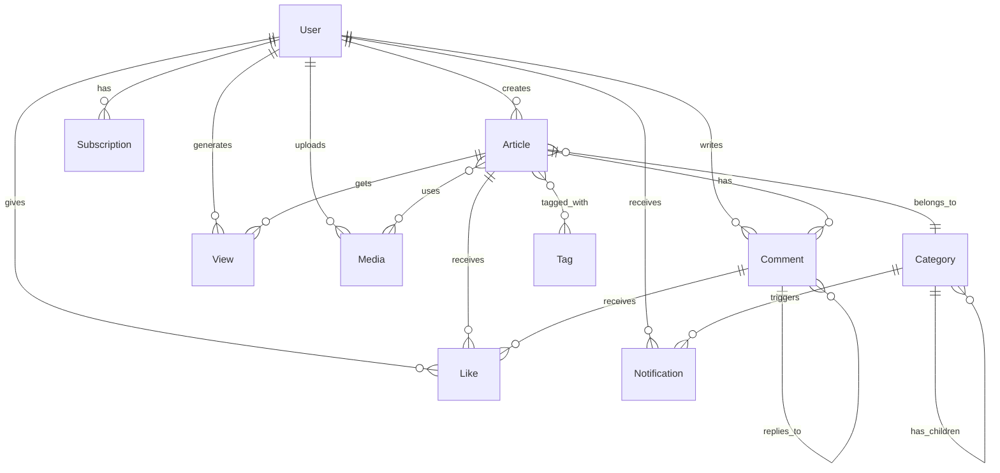
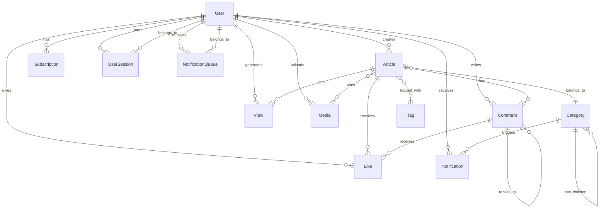

# 🗄️ Database Schemas - Noticias Pachuca 2025

> **Documentación completa** de todos los esquemas de base de datos del proyecto

## 📋 Índice de Esquemas

1. [User Schema](#user-schema) - ✅ Requerido para Auth
2. [Article Schema](#article-schema) - 📰 Contenido principal
3. [Category Schema](#category-schema) - 🏷️ Categorización
4. [Subscription Schema](#subscription-schema) - 💳 Modelo de suscripción
5. [Notification Schema](#notification-schema) - 🔔 Sistema de notificaciones
6. [Comment Schema](#comment-schema) - 💬 Comentarios de usuarios
7. [Like Schema](#like-schema) - ❤️ Sistema de likes
8. [View Schema](#view-schema) - 👁️ Tracking de vistas
9. [Tag Schema](#tag-schema) - 🏷️ Etiquetas de contenido
10. [Media Schema](#media-schema) - 🖼️ Archivos multimedia

---

## 🔐 User Schema

**Archivo:** `src/schemas/user.schema.ts`

```typescript
import { Prop, Schema, SchemaFactory } from '@nestjs/mongoose';
import { Document, Types } from 'mongoose';

export type UserDocument = User & Document;

export enum UserRole {
  ADMIN = 'admin',
  EDITOR = 'editor',
  SUBSCRIBER = 'subscriber',
  FREE_USER = 'free_user',
}

export enum SubscriptionStatus {
  ACTIVE = 'active',
  INACTIVE = 'inactive',
  EXPIRED = 'expired',
  CANCELLED = 'cancelled',
}

@Schema({
  timestamps: true,
  collection: 'users',
  toJSON: {
    transform: (doc, ret) => {
      ret.id = ret._id;
      delete ret._id;
      delete ret.__v;
      delete ret.password; // Nunca exponer password
      return ret;
    },
  },
})
export class User {
  @Prop({ required: true, unique: true, lowercase: true, trim: true })
  email: string;

  @Prop({ required: true, unique: true, trim: true })
  username: string;

  @Prop({ required: true, select: false }) // No incluir en queries por defecto
  password: string;

  @Prop({ required: true, trim: true })
  firstName: string;

  @Prop({ required: true, trim: true })
  lastName: string;

  @Prop({ default: null })
  avatar?: string;

  @Prop({ default: null })
  phone?: string;

  @Prop({ default: null })
  dateOfBirth?: Date;

  @Prop({ default: true })
  isActive: boolean;

  @Prop({ default: false })
  emailVerified: boolean;

  @Prop({ default: null })
  emailVerifiedAt?: Date;

  @Prop({ type: String, enum: UserRole, default: UserRole.FREE_USER })
  role: UserRole;

  // Información de suscripción
  @Prop({ type: String, enum: SubscriptionStatus, default: SubscriptionStatus.INACTIVE })
  subscriptionStatus: SubscriptionStatus;

  @Prop({ default: null })
  subscriptionStartDate?: Date;

  @Prop({ default: null })
  subscriptionEndDate?: Date;

  @Prop({ default: null })
  stripeCustomerId?: string;

  @Prop({ default: null })
  stripeSubscriptionId?: string;

  // Preferencias de notificaciones
  @Prop({
    type: {
      email: { type: Boolean, default: true },
      push: { type: Boolean, default: true },
      sms: { type: Boolean, default: false },
      breakingNews: { type: Boolean, default: true },
      dailyDigest: { type: Boolean, default: true },
      weeklyUpdate: { type: Boolean, default: true },
    },
    default: {},
  })
  notificationPreferences: {
    email: boolean;
    push: boolean;
    sms: boolean;
    breakingNews: boolean;
    dailyDigest: boolean;
    weeklyUpdate: boolean;
  };

  // Categorías de interés para notificaciones personalizadas
  @Prop({ type: [{ type: Types.ObjectId, ref: 'Category' }], default: [] })
  interestedCategories: Types.ObjectId[];

  // Tracking y analytics
  @Prop({ default: null })
  lastLoginAt?: Date;

  @Prop({ default: null })
  lastActiveAt?: Date;

  @Prop({ default: 0 })
  loginCount: number;

  @Prop({ default: null })
  lastLoginIP?: string;

  @Prop({ default: null })
  lastLoginUserAgent?: string;

  // Configuraciones de privacidad
  @Prop({
    type: {
      profilePublic: { type: Boolean, default: false },
      showEmail: { type: Boolean, default: false },
      allowComments: { type: Boolean, default: true },
      allowFollowers: { type: Boolean, default: true },
    },
    default: {},
  })
  privacySettings: {
    profilePublic: boolean;
    showEmail: boolean;
    allowComments: boolean;
    allowFollowers: boolean;
  };

  // Soft delete
  @Prop({ default: null })
  deletedAt?: Date;

  // Timestamps automáticos de Mongoose
  createdAt?: Date;
  updatedAt?: Date;
}

export const UserSchema = SchemaFactory.createForClass(User);

// Índices para performance
UserSchema.index({ email: 1 }, { unique: true });
UserSchema.index({ username: 1 }, { unique: true });
UserSchema.index({ subscriptionStatus: 1 });
UserSchema.index({ role: 1 });
UserSchema.index({ isActive: 1 });
UserSchema.index({ createdAt: -1 });
UserSchema.index({ lastActiveAt: -1 });

// Middleware para soft delete
UserSchema.pre(/^find/, function() {
  this.where({ deletedAt: { $exists: false } });
});

// Virtual para nombre completo
UserSchema.virtual('fullName').get(function() {
  return `${this.firstName} ${this.lastName}`;
});

// Virtual para verificar si es suscriptor activo
UserSchema.virtual('isActiveSubscriber').get(function() {
  return this.subscriptionStatus === SubscriptionStatus.ACTIVE &&
         this.subscriptionEndDate &&
         this.subscriptionEndDate > new Date();
});

// Virtual para verificar si puede ver contenido premium
UserSchema.virtual('canViewPremiumContent').get(function() {
  return this.role === UserRole.ADMIN ||
         this.role === UserRole.EDITOR ||
         this.isActiveSubscriber;
});
```

---

## 📰 Article Schema

**Archivo:** `src/schemas/article.schema.ts`

```typescript
import { Prop, Schema, SchemaFactory } from '@nestjs/mongoose';
import { Document, Types } from 'mongoose';

export type ArticleDocument = Article & Document;

export enum ArticleStatus {
  DRAFT = 'draft',
  PUBLISHED = 'published',
  ARCHIVED = 'archived',
  DELETED = 'deleted',
}

export enum ContentType {
  FREE = 'free',
  PREMIUM = 'premium',
  SUBSCRIBER_ONLY = 'subscriber_only',
}

@Schema({
  timestamps: true,
  collection: 'articles',
  toJSON: {
    transform: (doc, ret) => {
      ret.id = ret._id;
      delete ret._id;
      delete ret.__v;
      return ret;
    },
  },
})
export class Article {
  @Prop({ required: true, trim: true })
  title: string;

  @Prop({ required: true, unique: true })
  slug: string;

  @Prop({ required: true })
  content: string;

  @Prop({ trim: true })
  excerpt?: string;

  @Prop()
  featuredImage?: string;

  @Prop({ type: [String], default: [] })
  images: string[];

  @Prop({ type: Types.ObjectId, ref: 'User', required: true })
  author: Types.ObjectId;

  @Prop({ type: Types.ObjectId, ref: 'Category', required: true })
  category: Types.ObjectId;

  @Prop({ type: [{ type: Types.ObjectId, ref: 'Tag' }], default: [] })
  tags: Types.ObjectId[];

  @Prop({ type: String, enum: ArticleStatus, default: ArticleStatus.DRAFT })
  status: ArticleStatus;

  @Prop({ type: String, enum: ContentType, default: ContentType.FREE })
  contentType: ContentType;

  @Prop({ default: false })
  isFeatured: boolean;

  @Prop({ default: false })
  isBreakingNews: boolean;

  @Prop({ default: 0 })
  viewCount: number;

  @Prop({ default: 0 })
  likeCount: number;

  @Prop({ default: 0 })
  commentCount: number;

  @Prop({ default: 0 })
  shareCount: number;

  @Prop()
  publishedAt?: Date;

  @Prop()
  scheduledFor?: Date;

  // SEO
  @Prop()
  metaDescription?: string;

  @Prop({ type: [String], default: [] })
  metaKeywords: string[];

  @Prop()
  metaTitle?: string;

  // Analytics y engagement
  @Prop({ default: 0 })
  readingTime: number; // en minutos

  @Prop({ default: 0 })
  avgRating: number;

  @Prop({ default: 0 })
  ratingCount: number;

  // Configuraciones
  @Prop({ default: true })
  allowComments: boolean;

  @Prop({ default: true })
  allowSharing: boolean;

  @Prop({ default: true })
  showAuthor: boolean;

  // Geolocalización para noticias locales
  @Prop({
    type: {
      type: String,
      enum: ['Point'],
      default: 'Point',
    },
    coordinates: {
      type: [Number], // [longitude, latitude]
      default: undefined,
    },
  })
  location?: {
    type: string;
    coordinates: number[];
  };

  @Prop()
  locationName?: string;

  // Soft delete
  @Prop({ default: null })
  deletedAt?: Date;

  // Timestamps automáticos
  createdAt?: Date;
  updatedAt?: Date;
}

export const ArticleSchema = SchemaFactory.createForClass(Article);

// Índices para performance
ArticleSchema.index({ slug: 1 }, { unique: true });
ArticleSchema.index({ status: 1 });
ArticleSchema.index({ contentType: 1 });
ArticleSchema.index({ author: 1 });
ArticleSchema.index({ category: 1 });
ArticleSchema.index({ tags: 1 });
ArticleSchema.index({ publishedAt: -1 });
ArticleSchema.index({ isFeatured: 1, publishedAt: -1 });
ArticleSchema.index({ isBreakingNews: 1, publishedAt: -1 });
ArticleSchema.index({ viewCount: -1 });
ArticleSchema.index({ likeCount: -1 });
ArticleSchema.index({ location: '2dsphere' }); // Para búsquedas geoespaciales

// Índice de texto para búsqueda
ArticleSchema.index({
  title: 'text',
  content: 'text',
  excerpt: 'text',
  metaKeywords: 'text',
});

// Middleware para soft delete
ArticleSchema.pre(/^find/, function() {
  this.where({ deletedAt: { $exists: false } });
});

// Virtual para URL completa
ArticleSchema.virtual('url').get(function() {
  return `/articles/${this.slug}`;
});

// Virtual para verificar si está publicado
ArticleSchema.virtual('isPublished').get(function() {
  return this.status === ArticleStatus.PUBLISHED &&
         this.publishedAt &&
         this.publishedAt <= new Date();
});
```

---

## 🏷️ Category Schema

**Archivo:** `src/schemas/category.schema.ts`

```typescript
import { Prop, Schema, SchemaFactory } from '@nestjs/mongoose';
import { Document, Types } from 'mongoose';

export type CategoryDocument = Category & Document;

@Schema({
  timestamps: true,
  collection: 'categories',
  toJSON: {
    transform: (doc, ret) => {
      ret.id = ret._id;
      delete ret._id;
      delete ret.__v;
      return ret;
    },
  },
})
export class Category {
  @Prop({ required: true, trim: true })
  name: string;

  @Prop({ required: true, unique: true })
  slug: string;

  @Prop({ trim: true })
  description?: string;

  @Prop()
  icon?: string;

  @Prop()
  color?: string; // Color hex para UI

  @Prop()
  image?: string;

  // Jerarquía de categorías
  @Prop({ type: Types.ObjectId, ref: 'Category', default: null })
  parent?: Types.ObjectId;

  @Prop({ default: 0 })
  order: number; // Para ordenamiento manual

  @Prop({ default: true })
  isActive: boolean;

  @Prop({ default: true })
  showInNavigation: boolean;

  @Prop({ default: true })
  allowNotifications: boolean;

  // SEO
  @Prop()
  metaDescription?: string;

  @Prop()
  metaTitle?: string;

  // Estadísticas
  @Prop({ default: 0 })
  articleCount: number;

  @Prop({ default: 0 })
  subscriberCount: number;

  // Soft delete
  @Prop({ default: null })
  deletedAt?: Date;

  createdAt?: Date;
  updatedAt?: Date;
}

export const CategorySchema = SchemaFactory.createForClass(Category);

// Índices
CategorySchema.index({ slug: 1 }, { unique: true });
CategorySchema.index({ parent: 1 });
CategorySchema.index({ isActive: 1 });
CategorySchema.index({ order: 1 });
CategorySchema.index({ name: 'text', description: 'text' });

// Middleware para soft delete
CategorySchema.pre(/^find/, function() {
  this.where({ deletedAt: { $exists: false } });
});

// Virtual para URL
CategorySchema.virtual('url').get(function() {
  return `/categories/${this.slug}`;
});
```

---

## 💳 Subscription Schema

**Archivo:** `src/schemas/subscription.schema.ts`

```typescript
import { Prop, Schema, SchemaFactory } from '@nestjs/mongoose';
import { Document, Types } from 'mongoose';

export type SubscriptionDocument = Subscription & Document;

export enum SubscriptionPlan {
  FREE = 'free',
  BASIC = 'basic',
  PREMIUM = 'premium',
  ANNUAL = 'annual',
}

export enum PaymentStatus {
  PENDING = 'pending',
  COMPLETED = 'completed',
  FAILED = 'failed',
  REFUNDED = 'refunded',
  CANCELLED = 'cancelled',
}

@Schema({
  timestamps: true,
  collection: 'subscriptions',
  toJSON: {
    transform: (doc, ret) => {
      ret.id = ret._id;
      delete ret._id;
      delete ret.__v;
      return ret;
    },
  },
})
export class Subscription {
  @Prop({ type: Types.ObjectId, ref: 'User', required: true })
  user: Types.ObjectId;

  @Prop({ type: String, enum: SubscriptionPlan, required: true })
  plan: SubscriptionPlan;

  @Prop({ type: String, enum: PaymentStatus, default: PaymentStatus.PENDING })
  status: PaymentStatus;

  @Prop({ required: true })
  startDate: Date;

  @Prop({ required: true })
  endDate: Date;

  @Prop({ required: true })
  amount: number; // En centavos

  @Prop({ default: 'MXN' })
  currency: string;

  // Información de pago
  @Prop()
  stripeSubscriptionId?: string;

  @Prop()
  stripePaymentIntentId?: string;

  @Prop()
  stripeInvoiceId?: string;

  @Prop()
  paymentMethod?: string; // 'card', 'oxxo', 'spei', etc.

  // Información de la tarjeta (solo últimos 4 dígitos)
  @Prop()
  cardLast4?: string;

  @Prop()
  cardBrand?: string;

  // Auto-renovación
  @Prop({ default: true })
  autoRenew: boolean;

  @Prop()
  cancelledAt?: Date;

  @Prop()
  cancelReason?: string;

  // Descuentos y promociones
  @Prop()
  couponCode?: string;

  @Prop({ default: 0 })
  discountAmount: number;

  @Prop({ default: 0 })
  discountPercentage: number;

  // Facturación
  @Prop()
  invoiceNumber?: string;

  @Prop()
  billingAddress?: {
    street: string;
    city: string;
    state: string;
    zipCode: string;
    country: string;
  };

  // Metadata para analytics
  @Prop()
  source?: string; // 'web', 'mobile', 'promotion', etc.

  @Prop()
  campaignId?: string;

  createdAt?: Date;
  updatedAt?: Date;
}

export const SubscriptionSchema = SchemaFactory.createForClass(Subscription);

// Índices
SubscriptionSchema.index({ user: 1 });
SubscriptionSchema.index({ plan: 1 });
SubscriptionSchema.index({ status: 1 });
SubscriptionSchema.index({ startDate: 1, endDate: 1 });
SubscriptionSchema.index({ stripeSubscriptionId: 1 });
SubscriptionSchema.index({ endDate: 1 }); // Para encontrar suscripciones que expiran pronto

// Virtual para verificar si está activa
SubscriptionSchema.virtual('isActive').get(function() {
  const now = new Date();
  return this.status === PaymentStatus.COMPLETED &&
         this.startDate <= now &&
         this.endDate > now;
});

// Virtual para días restantes
SubscriptionSchema.virtual('daysRemaining').get(function() {
  const now = new Date();
  const diffTime = this.endDate.getTime() - now.getTime();
  return Math.ceil(diffTime / (1000 * 60 * 60 * 24));
});
```

---

## 🔔 Notification Schema

**Archivo:** `src/schemas/notification.schema.ts`

```typescript
import { Prop, Schema, SchemaFactory } from '@nestjs/mongoose';
import { Document, Types } from 'mongoose';

export type NotificationDocument = Notification & Document;

export enum NotificationType {
  BREAKING_NEWS = 'breaking_news',
  NEW_ARTICLE = 'new_article',
  DAILY_DIGEST = 'daily_digest',
  WEEKLY_UPDATE = 'weekly_update',
  SUBSCRIPTION_EXPIRY = 'subscription_expiry',
  COMMENT_REPLY = 'comment_reply',
  ARTICLE_LIKED = 'article_liked',
  SYSTEM_ALERT = 'system_alert',
}

export enum DeliveryMethod {
  PUSH = 'push',
  EMAIL = 'email',
  SMS = 'sms',
  IN_APP = 'in_app',
}

export enum NotificationStatus {
  PENDING = 'pending',
  SENT = 'sent',
  DELIVERED = 'delivered',
  FAILED = 'failed',
  READ = 'read',
}

@Schema({
  timestamps: true,
  collection: 'notifications',
  toJSON: {
    transform: (doc, ret) => {
      ret.id = ret._id;
      delete ret._id;
      delete ret.__v;
      return ret;
    },
  },
})
export class Notification {
  @Prop({ type: Types.ObjectId, ref: 'User', required: true })
  user: Types.ObjectId;

  @Prop({ type: String, enum: NotificationType, required: true })
  type: NotificationType;

  @Prop({ type: String, enum: DeliveryMethod, required: true })
  deliveryMethod: DeliveryMethod;

  @Prop({ required: true })
  title: string;

  @Prop({ required: true })
  message: string;

  @Prop()
  actionUrl?: string;

  @Prop()
  imageUrl?: string;

  // Información del artículo relacionado (si aplica)
  @Prop({ type: Types.ObjectId, ref: 'Article' })
  relatedArticle?: Types.ObjectId;

  @Prop({ type: Types.ObjectId, ref: 'Category' })
  relatedCategory?: Types.ObjectId;

  @Prop({ type: String, enum: NotificationStatus, default: NotificationStatus.PENDING })
  status: NotificationStatus;

  @Prop()
  sentAt?: Date;

  @Prop()
  deliveredAt?: Date;

  @Prop()
  readAt?: Date;

  @Prop()
  failureReason?: string;

  // Para notificaciones push
  @Prop()
  pushTokens?: string[];

  @Prop()
  fcmMessageId?: string;

  // Para emails
  @Prop()
  emailMessageId?: string;

  @Prop()
  emailTemplate?: string;

  // Para SMS
  @Prop()
  smsMessageId?: string;

  @Prop()
  phoneNumber?: string;

  // Metadata para personalización
  @Prop({ type: Object })
  templateData?: Record<string, any>;

  // Programación
  @Prop()
  scheduledFor?: Date;

  @Prop({ default: 0 })
  retryCount: number;

  @Prop()
  lastRetryAt?: Date;

  createdAt?: Date;
  updatedAt?: Date;
}

export const NotificationSchema = SchemaFactory.createForClass(Notification);

// Índices
NotificationSchema.index({ user: 1 });
NotificationSchema.index({ type: 1 });
NotificationSchema.index({ deliveryMethod: 1 });
NotificationSchema.index({ status: 1 });
NotificationSchema.index({ scheduledFor: 1 });
NotificationSchema.index({ sentAt: -1 });
NotificationSchema.index({ user: 1, status: 1, sentAt: -1 });

// Virtual para verificar si fue leída
NotificationSchema.virtual('isRead').get(function() {
  return this.status === NotificationStatus.READ;
});

// Virtual para verificar si está pendiente
NotificationSchema.virtual('isPending').get(function() {
  return this.status === NotificationStatus.PENDING;
});
```

---

## 💬 Comment Schema

**Archivo:** `src/schemas/comment.schema.ts`

```typescript
import { Prop, Schema, SchemaFactory } from '@nestjs/mongoose';
import { Document, Types } from 'mongoose';

export type CommentDocument = Comment & Document;

export enum CommentStatus {
  PENDING = 'pending',
  APPROVED = 'approved',
  REJECTED = 'rejected',
  SPAM = 'spam',
}

@Schema({
  timestamps: true,
  collection: 'comments',
  toJSON: {
    transform: (doc, ret) => {
      ret.id = ret._id;
      delete ret._id;
      delete ret.__v;
      return ret;
    },
  },
})
export class Comment {
  @Prop({ type: Types.ObjectId, ref: 'Article', required: true })
  article: Types.ObjectId;

  @Prop({ type: Types.ObjectId, ref: 'User', required: true })
  author: Types.ObjectId;

  @Prop({ required: true })
  content: string;

  // Respuestas a comentarios (threading)
  @Prop({ type: Types.ObjectId, ref: 'Comment', default: null })
  parentComment?: Types.ObjectId;

  @Prop({ type: [{ type: Types.ObjectId, ref: 'Comment' }], default: [] })
  replies: Types.ObjectId[];

  @Prop({ type: String, enum: CommentStatus, default: CommentStatus.PENDING })
  status: CommentStatus;

  @Prop({ default: 0 })
  likeCount: number;

  @Prop({ default: 0 })
  dislikeCount: number;

  // Moderación
  @Prop({ type: Types.ObjectId, ref: 'User' })
  moderatedBy?: Types.ObjectId;

  @Prop()
  moderatedAt?: Date;

  @Prop()
  moderationReason?: string;

  // Información del autor para comentarios de usuarios no registrados
  @Prop()
  guestName?: string;

  @Prop()
  guestEmail?: string;

  // Información técnica
  @Prop()
  ipAddress?: string;

  @Prop()
  userAgent?: string;

  // Reportes y spam
  @Prop({ default: 0 })
  reportCount: number;

  @Prop({ default: false })
  isSpam: boolean;

  // Soft delete
  @Prop({ default: null })
  deletedAt?: Date;

  createdAt?: Date;
  updatedAt?: Date;
}

export const CommentSchema = SchemaFactory.createForClass(Comment);

// Índices
CommentSchema.index({ article: 1 });
CommentSchema.index({ author: 1 });
CommentSchema.index({ parentComment: 1 });
CommentSchema.index({ status: 1 });
CommentSchema.index({ createdAt: -1 });
CommentSchema.index({ article: 1, status: 1, createdAt: -1 });

// Middleware para soft delete
CommentSchema.pre(/^find/, function() {
  this.where({ deletedAt: { $exists: false } });
});

// Virtual para verificar si es respuesta
CommentSchema.virtual('isReply').get(function() {
  return !!this.parentComment;
});

// Virtual para nivel de profundidad
CommentSchema.virtual('depth').get(function() {
  return this.parentComment ? 1 : 0; // Podría ser más complejo para threading profundo
});
```

---

## ❤️ Like Schema

**Archivo:** `src/schemas/like.schema.ts`

```typescript
import { Prop, Schema, SchemaFactory } from '@nestjs/mongoose';
import { Document, Types } from 'mongoose';

export type LikeDocument = Like & Document;

export enum LikeableType {
  ARTICLE = 'article',
  COMMENT = 'comment',
}

@Schema({
  timestamps: true,
  collection: 'likes',
  toJSON: {
    transform: (doc, ret) => {
      ret.id = ret._id;
      delete ret._id;
      delete ret.__v;
      return ret;
    },
  },
})
export class Like {
  @Prop({ type: Types.ObjectId, ref: 'User', required: true })
  user: Types.ObjectId;

  @Prop({ type: Types.ObjectId, required: true })
  likeable: Types.ObjectId; // ID del objeto que se likea

  @Prop({ type: String, enum: LikeableType, required: true })
  likeableType: LikeableType; // Tipo del objeto que se likea

  @Prop()
  ipAddress?: string;

  createdAt?: Date;
  updatedAt?: Date;
}

export const LikeSchema = SchemaFactory.createForClass(Like);

// Índices
LikeSchema.index({ user: 1, likeable: 1, likeableType: 1 }, { unique: true });
LikeSchema.index({ likeable: 1, likeableType: 1 });
LikeSchema.index({ user: 1 });
LikeSchema.index({ createdAt: -1 });
```

---

## 👁️ View Schema

**Archivo:** `src/schemas/view.schema.ts`

```typescript
import { Prop, Schema, SchemaFactory } from '@nestjs/mongoose';
import { Document, Types } from 'mongoose';

export type ViewDocument = View & Document;

@Schema({
  timestamps: true,
  collection: 'views',
  toJSON: {
    transform: (doc, ret) => {
      ret.id = ret._id;
      delete ret._id;
      delete ret.__v;
      return ret;
    },
  },
})
export class View {
  @Prop({ type: Types.ObjectId, ref: 'Article', required: true })
  article: Types.ObjectId;

  @Prop({ type: Types.ObjectId, ref: 'User' })
  user?: Types.ObjectId; // Null para usuarios anónimos

  @Prop({ required: true })
  ipAddress: string;

  @Prop()
  userAgent?: string;

  @Prop()
  referer?: string;

  @Prop()
  sessionId?: string;

  // Información geográfica
  @Prop()
  country?: string;

  @Prop()
  city?: string;

  // Información del dispositivo
  @Prop()
  device?: string; // 'mobile', 'desktop', 'tablet'

  @Prop()
  browser?: string;

  @Prop()
  os?: string;

  // Métricas de engagement
  @Prop({ default: 0 })
  timeSpent: number; // en segundos

  @Prop({ default: 0 })
  scrollPercentage: number; // 0-100

  @Prop({ default: false })
  isBot: boolean;

  @Prop({ default: false })
  isBounce: boolean; // Si salió rápido sin interactuar

  createdAt?: Date;
  updatedAt?: Date;
}

export const ViewSchema = SchemaFactory.createForClass(View);

// Índices
ViewSchema.index({ article: 1 });
ViewSchema.index({ user: 1 });
ViewSchema.index({ ipAddress: 1 });
ViewSchema.index({ createdAt: -1 });
ViewSchema.index({ article: 1, createdAt: -1 });
ViewSchema.index({ article: 1, ipAddress: 1, createdAt: -1 });
```

---

## 🏷️ Tag Schema

**Archivo:** `src/schemas/tag.schema.ts`

```typescript
import { Prop, Schema, SchemaFactory } from '@nestjs/mongoose';
import { Document } from 'mongoose';

export type TagDocument = Tag & Document;

@Schema({
  timestamps: true,
  collection: 'tags',
  toJSON: {
    transform: (doc, ret) => {
      ret.id = ret._id;
      delete ret._id;
      delete ret.__v;
      return ret;
    },
  },
})
export class Tag {
  @Prop({ required: true, unique: true, trim: true, lowercase: true })
  name: string;

  @Prop({ required: true, unique: true })
  slug: string;

  @Prop()
  description?: string;

  @Prop()
  color?: string; // Color hex para UI

  @Prop({ default: 0 })
  articleCount: number;

  @Prop({ default: true })
  isActive: boolean;

  // SEO
  @Prop()
  metaDescription?: string;

  createdAt?: Date;
  updatedAt?: Date;
}

export const TagSchema = SchemaFactory.createForClass(Tag);

// Índices
TagSchema.index({ name: 1 }, { unique: true });
TagSchema.index({ slug: 1 }, { unique: true });
TagSchema.index({ isActive: 1 });
TagSchema.index({ articleCount: -1 });
TagSchema.index({ name: 'text', description: 'text' });

// Virtual para URL
TagSchema.virtual('url').get(function() {
  return `/tags/${this.slug}`;
});
```

---

## 🖼️ Media Schema

**Archivo:** `src/schemas/media.schema.ts`

```typescript
import { Prop, Schema, SchemaFactory } from '@nestjs/mongoose';
import { Document, Types } from 'mongoose';

export type MediaDocument = Media & Document;

export enum MediaType {
  IMAGE = 'image',
  VIDEO = 'video',
  AUDIO = 'audio',
  DOCUMENT = 'document',
}

@Schema({
  timestamps: true,
  collection: 'media',
  toJSON: {
    transform: (doc, ret) => {
      ret.id = ret._id;
      delete ret._id;
      delete ret.__v;
      return ret;
    },
  },
})
export class Media {
  @Prop({ required: true })
  filename: string;

  @Prop({ required: true })
  originalName: string;

  @Prop({ required: true })
  mimeType: string;

  @Prop({ required: true })
  size: number; // en bytes

  @Prop({ type: String, enum: MediaType, required: true })
  type: MediaType;

  @Prop({ required: true })
  url: string;

  @Prop()
  thumbnailUrl?: string;

  @Prop({ type: Types.ObjectId, ref: 'User', required: true })
  uploadedBy: Types.ObjectId;

  // Metadatos para imágenes
  @Prop()
  width?: number;

  @Prop()
  height?: number;

  // Metadatos para videos/audio
  @Prop()
  duration?: number; // en segundos

  // Información de almacenamiento
  @Prop()
  storageProvider?: string; // 'local', 's3', 'cloudinary', etc.

  @Prop()
  storagePath?: string;

  @Prop()
  bucketName?: string;

  // ALT text para accesibilidad
  @Prop()
  altText?: string;

  @Prop()
  caption?: string;

  // Uso y referencias
  @Prop({ type: [{ type: Types.ObjectId, ref: 'Article' }], default: [] })
  usedInArticles: Types.ObjectId[];

  @Prop({ default: 0 })
  usageCount: number;

  // SEO y organización
  @Prop({ type: [String], default: [] })
  tags: string[];

  @Prop()
  folder?: string;

  // Soft delete
  @Prop({ default: null })
  deletedAt?: Date;

  createdAt?: Date;
  updatedAt?: Date;
}

export const MediaSchema = SchemaFactory.createForClass(Media);

// Índices
MediaSchema.index({ filename: 1 });
MediaSchema.index({ type: 1 });
MediaSchema.index({ uploadedBy: 1 });
MediaSchema.index({ mimeType: 1 });
MediaSchema.index({ createdAt: -1 });
MediaSchema.index({ tags: 1 });
MediaSchema.index({ folder: 1 });

// Middleware para soft delete
MediaSchema.pre(/^find/, function() {
  this.where({ deletedAt: { $exists: false } });
});

// Virtual para extensión de archivo
MediaSchema.virtual('extension').get(function() {
  return this.filename.split('.').pop();
});

// Virtual para tamaño legible
MediaSchema.virtual('humanSize').get(function() {
  const sizes = ['B', 'KB', 'MB', 'GB'];
  let size = this.size;
  let i = 0;

  while (size >= 1024 && i < sizes.length - 1) {
    size /= 1024;
    i++;
  }

  return `${size.toFixed(1)} ${sizes[i]}`;
});
```

---

## 📊 Resumen de Esquemas

### Relaciones Principales



### Índices Críticos por Performance

1. **Users**: email, username, subscriptionStatus, lastActiveAt
2. **Articles**: slug, status, publishedAt, category, tags, location
3. **Views**: article + createdAt, ipAddress + createdAt
4. **Comments**: article + status + createdAt
5. **Likes**: user + likeable + likeableType (unique)
6. **Notifications**: user + status + sentAt

### Consideraciones de Escalabilidad

- **Particionamiento**: Views y Notifications por fecha
- **Archivado**: Articles antiguos a colección separada
- **Índices TTL**: Cleanup automático de tokens expirados
- **Aggregation Pipeline**: Para estadísticas y reportes

---

## 🔔 User Session Schema (Para Notificaciones)

**Archivo:** `src/notifications/schemas/user-session.schema.ts`

```typescript
import { Prop, Schema, SchemaFactory } from '@nestjs/mongoose';
import { Document, Types } from 'mongoose';

export type UserSessionDocument = UserSession & Document;

export enum Platform {
  WEB = 'web',
  MOBILE = 'mobile',
  API = 'api',
}

export enum AppState {
  FOREGROUND = 'foreground',
  BACKGROUND = 'background',
}

@Schema({
  timestamps: true,
  collection: 'user_sessions',
  toJSON: {
    transform: (doc: Document, ret: Record<string, unknown>) => {
      ret.id = ret._id;
      delete ret._id;
      delete ret.__v;
      return ret;
    },
  },
})
export class UserSession {
  @Prop({ type: Types.ObjectId, ref: 'User', required: true })
  userId: Types.ObjectId;

  @Prop({ required: true })
  deviceId: string;

  @Prop({ type: String, enum: Platform, required: true })
  platform: Platform;

  @Prop()
  socketId?: string;

  @Prop({ default: true })
  isActive: boolean;

  @Prop({ type: String, enum: AppState, default: AppState.FOREGROUND })
  appState: AppState;

  @Prop()
  expoPushToken?: string;

  @Prop({
    type: {
      os: String,
      version: String,
      model: String,
      brand: String,
    },
  })
  deviceInfo?: {
    os?: string;
    version?: string;
    model?: string;
    brand?: string;
  };

  @Prop({ required: true })
  lastSeen: Date;

  @Prop()
  userAgent?: string;

  @Prop()
  ipAddress?: string;

  // TTL - Auto-delete después de 24 horas de inactividad
  @Prop({ default: Date.now, expires: 86400 })
  expiresAt: Date;

  createdAt?: Date;
  updatedAt?: Date;
}

export const UserSessionSchema = SchemaFactory.createForClass(UserSession);

// Índices únicos y performance
UserSessionSchema.index({ userId: 1, deviceId: 1 }, { unique: true });
UserSessionSchema.index({ userId: 1, isActive: 1 });
UserSessionSchema.index({ platform: 1, isActive: 1 });
UserSessionSchema.index({ expoPushToken: 1 });
UserSessionSchema.index({ lastSeen: -1 });
UserSessionSchema.index({ expiresAt: 1 }, { expireAfterSeconds: 0 });
```

---

## 📬 Notification Queue Schema

**Archivo:** `src/notifications/schemas/notification-queue.schema.ts`

```typescript
import { Prop, Schema, SchemaFactory } from '@nestjs/mongoose';
import { Document, Types } from 'mongoose';

export type NotificationQueueDocument = NotificationQueue & Document;

export enum NotificationType {
  BREAKING_NEWS = 'breaking_news',
  NEW_ARTICLE = 'new_article',
  DAILY_DIGEST = 'daily_digest',
  SUBSCRIPTION_EXPIRY = 'subscription_expiry',
  COMMENT_REPLY = 'comment_reply',
  SYSTEM_ALERT = 'system_alert',
  CUSTOM = 'custom',
}

export enum DeliveryMethod {
  SOCKET = 'socket',
  PUSH = 'push',
  AUTO = 'auto', // Sistema decide basado en app state
}

export enum NotificationStatus {
  PENDING = 'pending',
  PROCESSING = 'processing',
  SENT = 'sent',
  DELIVERED = 'delivered',
  FAILED = 'failed',
  EXPIRED = 'expired',
}

@Schema({
  timestamps: true,
  collection: 'notification_queue',
  toJSON: {
    transform: (doc: Document, ret: Record<string, unknown>) => {
      ret.id = ret._id;
      delete ret._id;
      delete ret.__v;
      return ret;
    },
  },
})
export class NotificationQueue {
  @Prop({ type: Types.ObjectId, ref: 'User', required: true })
  userId: Types.ObjectId;

  @Prop({ type: String, enum: NotificationType, required: true })
  type: NotificationType;

  @Prop({ type: String, enum: DeliveryMethod, default: DeliveryMethod.AUTO })
  deliveryMethod: DeliveryMethod;

  @Prop({ required: true })
  title: string;

  @Prop({ required: true })
  body: string;

  @Prop({ type: Object })
  data?: Record<string, unknown>;

  @Prop()
  actionUrl?: string;

  @Prop()
  imageUrl?: string;

  @Prop({ type: String, enum: NotificationStatus, default: NotificationStatus.PENDING })
  status: NotificationStatus;

  @Prop({ default: 'normal' })
  priority: string; // 'low', 'normal', 'high', 'urgent'

  @Prop({ default: Date.now })
  scheduledFor: Date;

  @Prop()
  sentAt?: Date;

  @Prop()
  deliveredAt?: Date;

  @Prop({ default: 0 })
  retryCount: number;

  @Prop()
  lastRetryAt?: Date;

  @Prop()
  failureReason?: string;

  // Para tracking de expo push
  @Prop()
  expoPushTicketId?: string;

  @Prop()
  expoPushReceiptId?: string;

  // Metadata para personalización
  @Prop({ type: Object })
  templateData?: Record<string, unknown>;

  // TTL - Auto-delete después de 30 días
  @Prop({ default: Date.now, expires: 2592000 })
  expiresAt: Date;

  createdAt?: Date;
  updatedAt?: Date;
}

export const NotificationQueueSchema = SchemaFactory.createForClass(NotificationQueue);

// Índices para performance
NotificationQueueSchema.index({ userId: 1, status: 1 });
NotificationQueueSchema.index({ status: 1, scheduledFor: 1 });
NotificationQueueSchema.index({ type: 1, status: 1 });
NotificationQueueSchema.index({ priority: 1, scheduledFor: 1 });
NotificationQueueSchema.index({ expoPushTicketId: 1 });
NotificationQueueSchema.index({ sentAt: -1 });
NotificationQueueSchema.index({ expiresAt: 1 }, { expireAfterSeconds: 0 });
```

---

## 📊 Resumen de Esquemas ACTUALIZADO

### Relaciones Principales



### Índices Críticos por Performance - ESQUEMAS UNIVERSALES

1. **Users**: email, username, subscriptionStatus, lastActiveAt
2. **UserSessions**: userId + deviceId (unique), userId + isActive, platform + isActive
3. **NotificationQueue**: userId + status, status + scheduledFor, type + status

### Índices Específicos por Proyecto (Solo agregar si el proyecto los usa)

- **Articles** (proyectos de contenido): slug, status, publishedAt, category, tags
- **Comments** (si hay sistema de comentarios): article + status + createdAt
- **Likes** (si hay sistema de likes): user + likeable + likeableType (unique)
- **Views** (si hay analytics de vistas): article + createdAt, ipAddress + createdAt
- **Notifications** (esquema viejo, reemplazado por NotificationQueue): user + status + sentAt

### Consideraciones de Escalabilidad ACTUALIZADO

- **Particionamiento**: Views, Notifications y NotificationQueue por fecha
- **Archivado**: Articles antiguos a colección separada
- **Índices TTL**: UserSessions (24h) y NotificationQueue (30 días) con cleanup automático
- **Aggregation Pipeline**: Para estadísticas y reportes
- **Redis Cache**: UserSessions en cache para acceso rápido
- **Sharded Collections**: NotificationQueue para alto volumen

---

¡Todos los esquemas están listos para implementar con Mongoose, incluyendo el nuevo sistema de notificaciones! 🚀