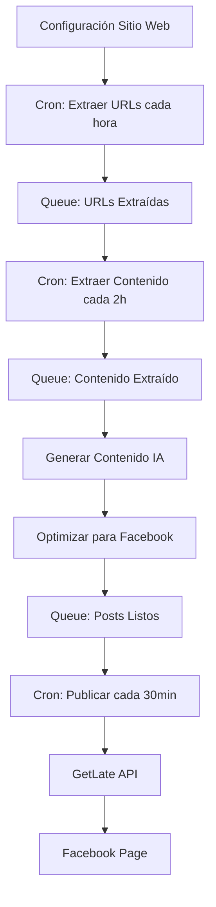

# 🤖 MÓDULO GENERATOR-PRO - CONTEXTO 2025

## 🚨 **CONTEXTO GENERATOR-PRO: SISTEMA AUTOMATIZADO DE NOTICIAS Y PUBLICACIÓN EN FACEBOOK**

### 🎯 **ESTADO ACTUAL DEL PROYECTO: ✅ ANÁLISIS COMPLETADO - LISTO PARA IMPLEMENTACIÓN**

#### ✅ **OBJETIVO DEL MÓDULO GENERATOR-PRO**

**Sistema automatizado completo** que extrae noticias de sitios web, genera contenido editorial usando IA, y publica automáticamente en Facebook con optimización SEO y engagement:

**🔄 FLUJO AUTOMATIZADO COMPLETO**:
1. **Configurar sitios web de noticias** - Alta de páginas con selectores CSS
2. **Extraer URLs de noticias** - Crawling automático cada hora del listado de noticias
3. **Extraer contenido básico** - Título, imagen y contenido de cada URL
4. **Generar contenido editorial** - Usar templates/prompts/agentes existentes
5. **Optimizar para Facebook** - Generar copy con emojis y hashtags para engagement
6. **Publicar en Facebook** - Usar GetLate.dev API cada 30 minutos

---

## 🔧 **ANÁLISIS ARQUITECTURA ACTUAL vs NECESIDADES**

### ✅ **QUÉ TENEMOS Y PODEMOS REUTILIZAR**

#### 🤖 **SISTEMA CONTENT-AI (100% FUNCIONAL)**
- ✅ **Schemas MongoDB**: `PromptTemplate`, `AIProvider`, `AIContentGeneration`
- ✅ **Services completos**: `ContentGenerationService`, `PromptTemplateService`
- ✅ **Endpoints funcionando**: `/content-ai/generate-from-news`
- ✅ **Templates/Prompts/Agentes**: Sistema wizard completo para crear agentes editoriales
- ✅ **OpenAI integración**: Configurado y funcional
- ✅ **Queue system**: Bull Queue con Redis para jobs asíncronos

#### 📰 **SISTEMA NOTICIAS (PARCIAL - REUTILIZABLE)**
- ✅ **Schemas base**: `ExternalUrl`, `ExtractedNoticia`, `NoticiasExtractionConfig`
- ✅ **Services existentes**: `NoticiasExtractionService`, `NoticiasScrapingService`
- ✅ **Configuración sitios**: Sistema para configurar selectores CSS
- ⚠️ **NECESITA ADAPTACIÓN**: Para generator-pro workflow específico

#### 🎯 **FRONTEND DASH-COYOTE (ARQUITECTURA SÓLIDA)**
- ✅ **TanStack Router**: Sistema de rutas completo
- ✅ **TanStack Query**: Hooks para data fetching
- ✅ **Shadcn UI**: Componentes consistentes
- ✅ **Features organizadas**: Estructura `/features/` para cada módulo

### 🚨 **QUÉ NECESITAMOS IMPLEMENTAR (LO QUE NO TENEMOS)**

#### 📅 **SISTEMA SCHEDULER AVANZADO**
- ❌ **Cron jobs específicos**: Extracción URLs cada hora, generación cada 2 horas
- ❌ **Publicación programada**: Posts cada 30 minutos con cola inteligente
- ❌ **Gestión de frecuencias**: Configuración flexible de intervalos

#### 📘 **INTEGRACIÓN FACEBOOK/GETLATE**
- ❌ **GetLate API client**: Autenticación y publicación
- ❌ **Facebook optimization**: Generación de emojis y hashtags
- ❌ **Media handling**: Subida de imágenes desde noticias extraídas
- ❌ **Publishing queue**: Cola específica para publicaciones sociales

#### 🎯 **LÓGICA ESPECÍFICA GENERATOR-PRO**
- ❌ **Workflow orchestration**: Conectar extracción → generación → publicación
- ❌ **Content filtering**: Evitar duplicados, filtrar contenido relevante
- ❌ **Facebook post optimization**: Copy específico para engagement

---

## 🚨 **REGLAS OBLIGATORIAS GENERATOR-PRO**

### 🔥 **REGLAS TÉCNICAS HEREDADAS DEL CONTEXTO BASE**
- ✅ **PROHIBIDO** usar `any` en TypeScript - Todo debe estar tipado correctamente
- ✅ **PROHIBIDO** usar `forwardRef` - Usar EventEmitter2 para dependencias circulares
- ✅ **PROHIBIDO** hacer `yarn start` o `yarn start:dev` - Solo hacer build para verificar
- ✅ **OBLIGATORIO** verificar Redis cache y flush si es necesario
- ✅ **OBLIGATORIO** leer este contexto antes de cada tarea
- ✅ **OBLIGATORIO** marcar tarea terminada antes de empezar siguiente - **NUEVA REGLA CRÍTICA**
- ✅ **OBLIGATORIO** volver a leer las reglas después de completar cada tarea
- ✅ **OBLIGATORIO** seguir estilos del proyecto y usar outlet del sidebar
- ✅ **OBLIGATORIO** implementar adapter pattern para integración GetLate

### 🎯 **REGLAS ESPECÍFICAS GENERATOR-PRO**
- ✅ **OBLIGATORIO** reutilizar schemas y services existentes siempre que sea posible
- ✅ **OBLIGATORIO** extender schemas existentes en lugar de crear nuevos
- ✅ **OBLIGATORIO** usar sistema de Queue (Bull + Redis) para todos los jobs asíncronos
- ✅ **OBLIGATORIO** implementar rate limiting según APIs externas (GetLate, sitios web)
- ✅ **OBLIGATORIO** crear logs detallados para debugging de cada paso del workflow
- ✅ **OBLIGATORIO** manejar errores gracefully - nunca romper el flujo completo
- ✅ **OBLIGATORIO** implementar retry logic con exponential backoff
- ✅ **OBLIGATORIO** validar contenido antes de publicar (no posts vacíos/incorrectos)

---

## 🏗️ **ARQUITECTURA GENERATOR-PRO**

### 📊 **FLUJO COMPLETO DEL SISTEMA**



### 🗄️ **NUEVOS SCHEMAS REQUERIDOS**

#### NewsWebsiteConfig Schema (EXTENDER NoticiasExtractionConfig)
```typescript
{
  _id: ObjectId,
  name: string, // "El Universal", "Milenio"
  baseUrl: string, // "https://www.eluniversal.com.mx"
  listingUrl: string, // URL donde están todas las noticias
  listingSelectors: {
    articleLinks: string, // CSS selector para links de noticias
    titleSelector?: string, // Para obtener título desde listing
    imageSelector?: string // Para obtener imagen desde listing
  },
  contentSelectors: {
    titleSelector: string, // CSS selector para título de la noticia
    contentSelector: string, // CSS selector para contenido
    imageSelector?: string, // CSS selector para imagen principal
    dateSelector?: string // CSS selector para fecha
  },
  extractionFrequency: number, // Frecuencia en minutos (60 = cada hora)
  contentGenerationFrequency: number, // Frecuencia generación (120 = cada 2h)
  isActive: boolean,
  lastExtractionRun?: Date,
  lastGenerationRun?: Date,
  createdAt: Date,
  updatedAt: Date
}
```

#### FacebookPublishingConfig Schema (NUEVO)
```typescript
{
  _id: ObjectId,
  websiteConfigId: ObjectId, // Referencia a NewsWebsiteConfig
  facebookPageId: string, // ID de la página de Facebook
  getLateApiKey: string, // API key de GetLate (encrypted)
  publishingFrequency: number, // Frecuencia en minutos (30 = cada 30min)
  templateId: ObjectId, // Template de Content-AI a usar
  postTemplate: string, // Template para el copy de Facebook
  useEmojis: boolean, // Activar optimización emojis
  useHashtags: boolean, // Activar optimización hashtags
  maxPostsPerDay: number, // Límite diario de posts
  isActive: boolean,
  lastPublishedAt?: Date,
  createdAt: Date,
  updatedAt: Date
}
```

#### GeneratorProJob Schema (NUEVO)
```typescript
{
  _id: ObjectId,
  type: string, // "extract_urls", "extract_content", "generate_content", "publish_facebook"
  websiteConfigId: ObjectId,
  status: string, // "pending", "processing", "completed", "failed"
  priority: number, // 1-10 (1 = highest)
  data: object, // Job-specific data
  result?: object, // Job result
  error?: string, // Error message if failed
  retryCount: number,
  maxRetries: number,
  scheduledAt: Date,
  startedAt?: Date,
  completedAt?: Date,
  processingTime?: number, // milliseconds
  createdAt: Date
}
```

#### FacebookPost Schema (NUEVO)
```typescript
{
  _id: ObjectId,
  originalNoticiaId: ObjectId, // Referencia a ExtractedNoticia
  generatedContentId: ObjectId, // Referencia a AIContentGeneration
  websiteConfigId: ObjectId,
  facebookConfigId: ObjectId,
  facebookPostId?: string, // ID del post en Facebook
  postContent: string, // Copy final para Facebook
  mediaUrls: string[], // URLs de imágenes
  emojis: string[], // Emojis utilizados
  hashtags: string[], // Hashtags utilizados
  scheduledAt: Date, // Cuándo se programó
  publishedAt?: Date, // Cuándo se publicó realmente
  status: string, // "scheduled", "published", "failed", "cancelled"
  engagement?: {
    likes?: number,
    comments?: number,
    shares?: number,
    lastUpdated?: Date
  },
  getLatePostUrl?: string, // URL del post en GetLate
  facebookPostUrl?: string, // URL del post en Facebook
  error?: string,
  createdAt: Date,
  updatedAt: Date
}
```

### 🛠️ **SERVICIOS REQUERIDOS**

#### GeneratorProOrchestratorService (NUEVO)
```typescript
class GeneratorProOrchestratorService {
  // Coordinar todo el flujo del sistema
  async startExtractionCycle(websiteConfigId: ObjectId): Promise<void>
  async startGenerationCycle(websiteConfigId: ObjectId): Promise<void>
  async startPublishingCycle(websiteConfigId: ObjectId): Promise<void>
  async getSystemStatus(): Promise<SystemStatus>
  async pauseWebsite(websiteConfigId: ObjectId): Promise<void>
  async resumeWebsite(websiteConfigId: ObjectId): Promise<void>
}
```

#### NewsWebsiteService (EXTENDER NoticiasExtractionService)
```typescript
class NewsWebsiteService extends NoticiasExtractionService {
  // Gestión específica para Generator-Pro
  async extractNewsUrls(configId: ObjectId): Promise<string[]>
  async extractNewsContent(url: string, configId: ObjectId): Promise<ExtractedNews>
  async validateSelectors(config: NewsWebsiteConfig): Promise<boolean>
  async testExtraction(config: NewsWebsiteConfig): Promise<TestResult>
}
```

#### FacebookPublishingService (NUEVO)
```typescript
class FacebookPublishingService {
  // Integración completa con GetLate
  async publishPost(post: FacebookPost): Promise<PublishResult>
  async schedulePost(post: FacebookPost, publishAt: Date): Promise<void>
  async optimizeForFacebook(content: string): Promise<FacebookOptimization>
  async generateEmojis(content: string): Promise<string[]>
  async generateHashtags(content: string, category: string): Promise<string[]>
  async uploadMedia(imageUrls: string[]): Promise<string[]>
  async validatePageConnection(pageId: string, apiKey: string): Promise<boolean>
}
```

#### GeneratorProQueueService (NUEVO)
```typescript
class GeneratorProQueueService {
  // Gestión específica de colas Generator-Pro
  async addExtractionJob(websiteConfigId: ObjectId): Promise<Job>
  async addGenerationJob(extractedNoticiaId: ObjectId): Promise<Job>
  async addPublishingJob(generatedContentId: ObjectId): Promise<Job>
  async getJobStats(): Promise<JobStats>
  async retryFailedJobs(): Promise<void>
  async clearQueue(queueName: string): Promise<void>
}
```

### 🎯 **CONTROLLERS Y ENDPOINTS**

#### GeneratorProController (NUEVO)
```typescript
// Gestión de configuraciones de sitios web
GET /generator-pro/websites - Listar sitios configurados
POST /generator-pro/websites - Crear nueva configuración
PUT /generator-pro/websites/:id - Actualizar configuración
DELETE /generator-pro/websites/:id - Eliminar configuración
POST /generator-pro/websites/:id/test - Probar selectores

// Gestión de configuraciones de Facebook
GET /generator-pro/facebook-configs - Listar configs Facebook
POST /generator-pro/facebook-configs - Crear config Facebook
PUT /generator-pro/facebook-configs/:id - Actualizar config
DELETE /generator-pro/facebook-configs/:id - Eliminar config

// Control del sistema
GET /generator-pro/status - Estado general del sistema
POST /generator-pro/start/:websiteId - Iniciar procesamiento
POST /generator-pro/stop/:websiteId - Pausar procesamiento
GET /generator-pro/jobs - Estado de trabajos en cola
POST /generator-pro/jobs/:id/retry - Reintentar trabajo fallido

// Monitoreo y analytics
GET /generator-pro/posts - Lista de posts publicados
GET /generator-pro/analytics - Métricas y estadísticas
GET /generator-pro/logs - Logs del sistema
```

---

## 🎨 **FRONTEND GENERATOR-PRO**

### 📱 **NUEVA RUTA Y ESTRUCTURA**
- ✅ Crear `/src/features/generator-pro/`
- ✅ Crear ruta `/generator-pro` en TanStack Router
- ✅ Agregar tab "Generator Pro" al `AppSidebar.tsx`

### 🏗️ **COMPONENTES REQUERIDOS**

#### GeneratorProDashboard.tsx (PRINCIPAL)
```typescript
// Tabs principales:
// 1. "Resumen" - Overview general del sistema
// 2. "Sitios Web" - Gestión de sitios de noticias
// 3. "Facebook" - Configuraciones de publicación
// 4. "Contenido" - Noticias extraídas y contenido generado
// 5. "Posts" - Posts publicados en Facebook
// 6. "Jobs & Logs" - Monitoreo de trabajos y logs
```

#### Tab "Sitios Web" - WebsiteConfigTab.tsx
- ✅ Tabla de sitios configurados
- ✅ CRUD para agregar/editar sitios
- ✅ Test de selectores CSS
- ✅ Control de activación/desactivación
- ✅ Métricas de extracción por sitio

#### Tab "Facebook" - FacebookConfigTab.tsx
- ✅ Configuraciones de páginas Facebook
- ✅ Test de conexión con GetLate
- ✅ Gestión de templates y frecuencias
- ✅ Preview de posts optimizados

#### Tab "Contenido" - ContentTab.tsx
- ✅ Noticias extraídas pendientes
- ✅ Contenido generado por IA
- ✅ Cola de contenido listo para publicar
- ✅ Comparador original vs generado

#### Tab "Posts" - PostsTab.tsx
- ✅ Posts publicados en Facebook
- ✅ Métricas de engagement
- ✅ Programación manual de posts
- ✅ Historial de publicaciones

### 🎯 **HOOKS REQUERIDOS**
```typescript
// Data fetching hooks
useWebsiteConfigs() - Gestión de sitios web
useFacebookConfigs() - Configuraciones Facebook
useGeneratorProJobs() - Estados de trabajos
useGeneratedPosts() - Posts generados y publicados
useSystemStatus() - Estado general del sistema

// Action hooks
useCreateWebsiteConfig() - Crear configuración sitio
useTestSelectors() - Probar selectores CSS
usePublishPost() - Publicación manual
useStartSystem() - Iniciar/pausar sistema
```

---

## 🚀 **PLAN DE IMPLEMENTACIÓN GENERATOR-PRO**

### 📝 **FASE 1: BACKEND FOUNDATION** ⚠️ PENDIENTE
- [ ] **Crear nuevos schemas MongoDB**:
  - [ ] `NewsWebsiteConfig` (extender `NoticiasExtractionConfig`)
  - [ ] `FacebookPublishingConfig`
  - [ ] `GeneratorProJob`
  - [ ] `FacebookPost`
- [ ] **Implementar services base**:
  - [ ] `GeneratorProOrchestratorService`
  - [ ] `NewsWebsiteService` (extender existente)
  - [ ] `FacebookPublishingService`
  - [ ] `GeneratorProQueueService`
- [ ] **Crear controllers y endpoints**:
  - [ ] `GeneratorProController` con todos los endpoints
  - [ ] Validaciones y DTOs específicos
- [ ] **Configurar nuevas colas Bull**:
  - [ ] `generator-pro-extraction`
  - [ ] `generator-pro-generation`
  - [ ] `generator-pro-publishing`

### 📝 **FASE 2: INTEGRACIÓN GETLATE** ⚠️ PENDIENTE
- [ ] **Implementar GetLate API client**:
  - [ ] Autenticación y manejo de API keys
  - [ ] Upload de media (imágenes)
  - [ ] Publicación de posts
  - [ ] Rate limiting y retry logic
- [ ] **Optimización para Facebook**:
  - [ ] Generación de emojis contextual
  - [ ] Research de hashtags trending
  - [ ] Optimización de copy para engagement
- [ ] **Testing de integración**:
  - [ ] Test de publicación real
  - [ ] Validación de media uploads
  - [ ] Manejo de errores API

### 📝 **FASE 3: SCHEDULER Y AUTOMATION** ⚠️ PENDIENTE
- [ ] **Implementar cron jobs**:
  - [ ] Extracción URLs cada hora
  - [ ] Generación contenido cada 2 horas
  - [ ] Publicación cada 30 minutos
- [ ] **Queue processing**:
  - [ ] Processors para cada tipo de job
  - [ ] Priority handling
  - [ ] Dead letter queue management
- [ ] **Monitoring y logging**:
  - [ ] Logs detallados por cada step
  - [ ] Métricas de performance
  - [ ] Alertas por errores críticos

### 📝 **FASE 4: FRONTEND GENERATOR-PRO** ⚠️ PENDIENTE
- [ ] **Estructura base**:
  - [ ] Feature folder `/features/generator-pro/`
  - [ ] Ruta `/generator-pro` en router
  - [ ] Tab en sidebar
- [ ] **Dashboard principal**:
  - [ ] `GeneratorProDashboard.tsx`
  - [ ] Todos los tabs funcionales
  - [ ] Estados de loading y error
- [ ] **Componentes específicos**:
  - [ ] Forms para configuración sitios
  - [ ] Test de selectores CSS
  - [ ] Preview de posts Facebook
  - [ ] Monitoreo de jobs en tiempo real

### 📝 **FASE 5: TESTING Y OPTIMIZATION** ⚠️ PENDIENTE
- [ ] **Testing end-to-end**:
  - [ ] Flujo completo extraction → generation → publishing
  - [ ] Test con sitios web reales
  - [ ] Validación de posts en Facebook
- [ ] **Performance optimization**:
  - [ ] Optimización de queries MongoDB
  - [ ] Cache strategies
  - [ ] Rate limiting fine-tuning
- [ ] **Production readiness**:
  - [ ] Error monitoring
  - [ ] Backup strategies
  - [ ] Security audit

---

## 🚨 **CONSIDERACIONES CRÍTICAS**

### ⚡ **RATE LIMITING Y APIS EXTERNAS**
- ✅ **GetLate API**: 60-1200 req/min según plan
- ✅ **Sitios web**: Respetar robots.txt y no sobrecargar
- ✅ **Facebook API**: Límites via GetLate, monitor usage

### 🛡️ **SEGURIDAD Y VALIDACIÓN**
- ✅ **API Keys**: Encriptar GetLate keys en BD
- ✅ **Content validation**: No publicar contenido inapropiado
- ✅ **GDPR compliance**: Manejo responsable de datos extraídos
- ✅ **Error handling**: Nunca exponer keys o datos sensibles

### 📊 **MONITORING Y MAINTENANCE**
- ✅ **Health checks**: APIs externas y internal services
- ✅ **Content quality**: Métricas de engagement Facebook
- ✅ **System performance**: Queue processing times
- ✅ **Cost monitoring**: Tracking de usage GetLate y OpenAI

---

## 🎉 **RESULTADO ESPERADO**

**Sistema completamente automatizado** que:

1. ✅ **Configura sitios web** con interfaz visual para selectores CSS
2. ✅ **Extrae noticias** automáticamente cada hora
3. ✅ **Genera contenido editorial** usando IA con templates existentes
4. ✅ **Optimiza para Facebook** con emojis y hashtags trending
5. ✅ **Publica automáticamente** cada 30 minutos en Facebook
6. ✅ **Monitorea engagement** y ajusta estrategia
7. ✅ **Proporciona dashboard** completo para gestión y analytics

**Meta final**: Sistema autónomo que genere engagement en Facebook mediante contenido de noticias locales tropicalizadas y optimizadas por IA.

---

## 📋 **CHECKLIST PRÓXIMA SESIÓN**

### 🚨 **ANTES DE EMPEZAR CUALQUIER TAREA**
- [ ] ✅ **LEER** este contexto completo
- [ ] ✅ **MARCAR** tarea como in_progress antes de empezar
- [ ] ✅ **VERIFICAR** que no hay `any` en TypeScript
- [ ] ✅ **USAR** EventEmitter2 para dependencias circulares
- [ ] ✅ **MARCAR** tarea como completed al terminar
- [ ] ✅ **VOLVER A LEER** las reglas después de completar

### 🎯 **PRIMERA TAREA RECOMENDADA**
**Implementar Fase 1: Backend Foundation** - Empezar con schemas MongoDB y services base, reutilizando toda la arquitectura existente del sistema Content-AI y Noticias.

**RECORDATORIO CRÍTICO**: El éxito de Generator-Pro depende de reutilizar correctamente los sistemas existentes (Content-AI para generación, Noticias para extracción) y crear la nueva lógica específica (GetLate integration, scheduling, Facebook optimization).

---

## 🔄 **DESVIACIÓN/MEJORA REQUERIDA - MODAL SITIOS WEB UX**

### 📊 **ANÁLISIS ESTADO ACTUAL vs REQUERIDO**

#### ✅ **QUÉ TENEMOS IMPLEMENTADO (ESTADO ACTUAL)**:
- ✅ Modal "Agregar Nuevo Sitio Web" funcional con campos básicos
- ✅ Endpoint `/generator-pro/websites/test-selectors` implementado
- ✅ Hook `useTestSelectors` en frontend funcionando
- ✅ Schemas MongoDB: `NewsWebsiteConfig` y `FacebookPublishingConfig`
- ✅ Estilos correctos del modal (tamaño y inputs perfectos según usuario)
- ✅ Campos actuales: name, baseUrl, listingUrl, selectores CSS, frecuencias

#### ❌ **QUÉ FALTA IMPLEMENTAR (REQUERIMIENTOS NUEVOS)**:
- ❌ **Campo URL de prueba individual**: Para testing de selectores de contenido
- ❌ **Botón "Probar Selectores Listado"**: Testing en tiempo real de URLs extraídas
- ❌ **Botón "Probar Contenido Individual"**: Testing de extracción de una noticia específica
- ❌ **Vista previa de resultados**: Mostrar URLs/contenido extraído antes de guardar
- ❌ **Integración GetLate.dev**: Listar páginas de Facebook disponibles
- ❌ **Selector de páginas Facebook**: Permitir elegir dónde publicar
- ❌ **API Key GetLate configurada**: `sk_a7e92958841ee94d4d95b99f88b1f7b0fb7672a60b0fca50f27b190476d98cd8`

### 🎯 **MICRO-TAREAS NECESARIAS**:

#### **FASE A: Backend - Testing y GetLate Integration**
1. ✅ **Crear endpoint GetLate Facebook Pages**: `GET /generator-pro/facebook-pages` - COMPLETADO
2. ✅ **Mejorar endpoint test-selectors**: Soportar testing individual y listado - COMPLETADO
3. ✅ **Crear DTOs adicionales**: `TestIndividualContentDto`, `FacebookPageDto` - COMPLETADO
4. ✅ **Implementar FacebookPagesService**: Integración con GetLate.dev API - COMPLETADO
5. ✅ **Actualizar NewsWebsiteService**: Agregar método para test de URLs individuales - COMPLETADO

#### **FASE B: Frontend - Modal UX Mejorado**
1. ✅ **Agregar campo "URL de prueba"**: Input adicional en el modal - COMPLETADO
2. ✅ **Implementar botones testing**: "Probar Listado" y "Probar Contenido" - COMPLETADO
3. ✅ **Crear componentes vista previa**: Mostrar resultados de testing - COMPLETADO
4. ✅ **Agregar selector Facebook pages**: Dropdown con páginas disponibles - COMPLETADO
5. ✅ **Crear hook `useFacebookPages`**: Para obtener páginas de GetLate - COMPLETADO
6. ✅ **Actualizar validaciones**: Incluir nuevos campos requeridos - COMPLETADO

#### **FASE C: Integración y Testing**
1. **Testing end-to-end**: Probar flujo completo del modal mejorado
2. **Validar integración GetLate**: Verificar listado de páginas
3. **Validar testing selectores**: URLs listado + contenido individual
4. **Build y corrección errores**: Verificar compilación TypeScript
5. **Documentar cambios**: Actualizar este contexto con implementación

### 🔗 **DEPENDENCIAS TÉCNICAS**:
- API Key GetLate: `sk_a7e92958841ee94d4d95b99f88b1f7b0fb7672a60b0fca50f27b190476d98cd8`
- Reutilizar: `NewsWebsiteService.testSelectors()` existente
- Extender: `CreateWebsiteConfigRequest` interface
- Nuevo: `FacebookPagesService` para integración GetLate.dev

### 📋 **RESULTADO ESPERADO**:
Modal mejorado que permita:
1. **Testing en tiempo real**: Ver URLs extraídas y contenido de prueba
2. **Configuración Facebook**: Seleccionar páginas específicas para publicar
3. **UX fluida**: Probar antes de guardar, evitar errores de configuración
4. **Integración transparente**: Sin conflictos con sistema existente

---

## 🎯 **IMPLEMENTACIÓN REALIZADA - FASE A**

### ✅ **LO QUE SE IMPLEMENTÓ EXITOSAMENTE**:

#### 🔧 **Backend Endpoints Completados**:
1. **GET /generator-pro/facebook-pages** - Lista páginas de Facebook disponibles via GetLate.dev
2. **POST /generator-pro/websites/test-listing-selectors** - Prueba extracción de URLs desde listado
3. **POST /generator-pro/websites/test-individual-content** - Prueba extracción de contenido específico

#### 📋 **DTOs Avanzados Creados**:
- `TestListingSelectorsDto`: Testing de selectores para extracción de URLs
- `TestIndividualContentDto`: Testing de selectores para contenido individual
- `TestListingResponseDto`: Response con URLs extraídas, tiempos, errores
- `TestContentResponseDto`: Response con contenido extraído, validaciones
- `FacebookPageDto`: Estructura para páginas de Facebook
- `FacebookPagesResponseDto`: Response con lista de páginas disponibles

#### 🛠️ **Services Implementados**:
- **FacebookPagesService**: Integración completa con GetLate.dev API
  - `getFacebookPages()`: Lista páginas disponibles
  - `validatePageConnection()`: Valida conexión con página específica
  - `getPageDetails()`: Obtiene detalles de página individual
- **NewsWebsiteService** (métodos agregados):
  - `testListingSelectors()`: Test avanzado de extracción de URLs
  - `testIndividualContent()`: Test avanzado de extracción de contenido

#### ⚙️ **Configuración Técnica**:
- ✅ API Key GetLate configurada: `sk_a7e92958841ee94d4d95b99f88b1f7b0fb7672a60b0fca50f27b190476d98cd8`
- ✅ EventEmitter2 para comunicación entre módulos
- ✅ Build exitoso sin errores TypeScript
- ✅ Integración transparente con arquitectura existente

---

## 🎯 **IMPLEMENTACIÓN REALIZADA - FASE B**

### ✅ **LO QUE SE IMPLEMENTÓ EXITOSAMENTE EN FRONTEND**:

#### 🎨 **Modal UX Mejorado Completado**:
1. **Campo URL de prueba**: Input opcional para testing de contenido específico
2. **Botones testing avanzados**:
   - "Probar Listado" - extrae URLs del listado
   - "Probar Contenido" - extrae contenido de URL específica
   - "Test Completo" - método legacy mantenido
3. **Vista previa de resultados**: Dialogs expandidos con resultados detallados
4. **Selector Facebook pages**: Dropdown con páginas disponibles de GetLate.dev

#### 🔧 **Componentes Frontend Actualizados**:
- **SitiosWebTab.tsx**: Modal completamente renovado con testing en tiempo real
- **Tipos TypeScript**: Nuevos interfaces para testing avanzado
- **Hooks React**: Nuevos hooks para testing individual y listado
- **UI/UX**: Vista previa detallada con métricas, errores y contenido extraído

#### 📊 **Funcionalidades de Testing**:
- **Testing de Listado**: Ver URLs extraídas en tiempo real antes de guardar
- **Testing Individual**: Probar selectores con URL específica
- **Vista previa completa**: Títulos, contenido, imágenes, autor, categoría
- **Métricas de performance**: Tiempo de procesamiento, caracteres extraídos
- **Manejo de errores**: Mensajes claros de fallos y sugerencias

#### 🔗 **Integración GetLate.dev**:
- **Hook `useFacebookPages()`**: Obtiene páginas de Facebook disponibles
- **Selector visual**: Dropdown con nombres y seguidores de páginas
- **Estado en tiempo real**: Indicador visual de página seleccionada

---

## 🚨 **NUEVA DESVIACIÓN REQUERIDA - 6 PESTAÑAS SEPARADAS FLUJO COMPLETO**

### 📊 **ANÁLISIS ESTADO ACTUAL vs REQUERIMIENTO 6-TAB WORKFLOW**

#### ✅ **QUÉ TENEMOS IMPLEMENTADO (ESTADO ACTUAL)**:
- ✅ **Tab Sitios Web**: CRUD sitios + testing selectores - COMPLETO
- ✅ **Tab Facebook**: Configuración páginas + GetLate integration - COMPLETO
- ✅ **Endpoints backend**: Testing, extracción URLs, generación mock - COMPLETOS
- ✅ **Schemas MongoDB**: `NewsWebsiteConfig`, `FacebookPublishingConfig`, etc. - COMPLETOS
- ✅ **Frontend UI**: Modal complejo con workflow paso a paso - COMPLETO pero EQUIVOCADO

#### ❌ **NUEVA ARQUITECTURA REQUERIDA - 6 TABS SEPARADAS**:
El usuario requiere **6 pestañas completamente separadas** en lugar del modal workflow:

1. **📋 Tab "Sitios Web"** - ✅ YA EXISTE - Solo configurar sitios
2. **🔗 Tab "URLs"** - ❌ NUEVA - Listar URLs extraídas + botón extracción manual
3. **📄 Tab "Contenido"** - ❌ NUEVA - Contenidos extraídos + selector template/agente
4. **🎯 Tab "Generados"** - ❌ NUEVA - Contenidos generados con IA + versiones
5. **📘 Tab "Facebook"** - ✅ PARCIAL - Configurar páginas + auto-publicador ON/OFF
6. **📮 Tab "Posts"** - ❌ NUEVA - Posts publicados/programados

#### 🔄 **FLUJO COMPLETO 6-TAB WORKFLOW**:
- **Sitios Web** → configurar sitios → [extracción manual] → **URLs Tab**
- **URLs Tab** → seleccionar URLs → [extraer contenido] → **Contenido Tab**
- **Contenido Tab** → elegir template/agente → [generar] → **Generados Tab**
- **Generados Tab** → publicar manual/auto → **Posts Tab**
- **Facebook Tab** → configurar páginas + auto-publicador
- **Posts Tab** → ver publicados + métricas

### 🎯 **MICRO-TAREAS ESPECÍFICAS 6-TAB WORKFLOW**:

#### **FASE C: Backend - Endpoints para 6 tabs**
1. ❌ **Crear endpoint URLs persistencia**: `POST /generator-pro/websites/:id/extract-urls-and-save`
   - Extraer URLs y GUARDAR en tabla `extracted_noticias`
   - Devolver URLs guardadas con IDs BD para Tab URLs
2. ❌ **Crear endpoint listar URLs**: `GET /generator-pro/urls` - Para poblar Tab URLs
3. ❌ **Crear endpoint extraer contenido**: `POST /generator-pro/urls/extract-content` - URLs → Contenido Tab
4. ❌ **Crear endpoint listar contenidos**: `GET /generator-pro/content` - Para poblar Tab Contenido
5. ❌ **Crear endpoint content agents**: `GET /generator-pro/content-agents` - Para selectors Tab Contenido
6. ❌ **Crear endpoint generar contenido real**: `POST /generator-pro/content/generate` - Contenido → Generados
7. ❌ **Crear endpoint listar generados**: `GET /generator-pro/generated` - Para poblar Tab Generados
8. ❌ **Crear endpoint publicar posts**: `POST /generator-pro/publish` - Generados → Posts
9. ❌ **Crear endpoint listar posts**: `GET /generator-pro/posts` - Para poblar Tab Posts

#### **FASE D: Frontend - 6 Tabs Separados Completos**
1. ❌ **Crear Tab URLs** (`URLsTab.tsx`):
   - Tabla URLs extraídas con estados (nueva/procesada)
   - Botón "Extraer Contenido" por URL
   - Filtros por sitio web y fecha
2. ❌ **Crear Tab Contenido** (`ContenidoTab.tsx`):
   - Tabla contenidos extraídos
   - Selector template/agente por contenido
   - Botón "Generar" individual/batch
3. ❌ **Crear Tab Generados** (`GeneradosTab.tsx`):
   - Tabla contenidos generados con versiones
   - Vista previa de contenido
   - Botones publicar manual + auto-publicador
4. ❌ **Actualizar Tab Facebook**: Agregar toggle auto-publicador ON/OFF
5. ❌ **Crear Tab Posts** (`PostsTab.tsx`):
   - Tabla posts publicados/programados
   - Métricas engagement
   - Estados publicación
6. ❌ **Remover modal workflow**: Simplificar Tab Sitios Web solo CRUD

#### **FASE E: Testing e Integración**
1. ❌ **Testing end-to-end**: Flujo completo manual con persistencia
2. ❌ **Validar integración ContentAI**: Sin romper módulo existente
3. ❌ **Build y corrección errores**: Verificar compilación TypeScript
4. ❌ **Documentar flujo implementado**: Actualizar contexto con resultados

### 🔗 **DEPENDENCIAS TÉCNICAS CRÍTICAS**:
- **REUTILIZAR**: `NewsWebsiteService.extractUrlsManually()` - NO crear nueva lógica
- **REUTILIZAR**: `ContentGenerationService` del módulo ContentAI - NO duplicar
- **EXTENDER**: Schemas existentes `ExtractedNoticia` y `AIContentGeneration`
- **RESOLVER**: Dependencia circular ContentAI ↔ GeneratorPro con EventEmitter2

### 🚨 **RIESGOS IDENTIFICADOS Y MITIGACIÓN**:
- **RIESGO**: Romper testing existente al modificar endpoints
- **MITIGACIÓN**: Crear NUEVOS endpoints, mantener existentes intactos
- **RIESGO**: Dependencia circular ContentGenerationService
- **MITIGACIÓN**: Usar EventEmitter2 según reglas de contexto
- **RIESGO**: Duplicar lógica de extracción/generación
- **MITIGACIÓN**: Reutilizar services existentes, solo crear orchestration

### 📋 **RESULTADO ESPERADO FLUJO MANUAL**:
Workflow manual completo que permita:
1. **Click botón manual** → Extraer y GUARDAR URLs en `extracted_noticias`
2. **Seleccionar agente** → Por cada URL extraída
3. **Generar contenido** → Con agente seleccionado, GUARDAR en `ai_content_generations`
4. **Ver resultados** → Contenido generado con persistencia en BD
5. **NO romper** → Sistema automático existente ni testing

---

## 📋 **CHECKLIST ACTUALIZADO - FLUJO MANUAL WORKFLOW**

### 🚨 **ANTES DE EMPEZAR CUALQUIER TAREA MANUAL WORKFLOW**
- [ ] ✅ **LEER** contexto completo Generator-Pro
- [ ] ✅ **IDENTIFICAR** schemas existentes a reutilizar
- [ ] ✅ **VERIFICAR** que no hay `any` en TypeScript
- [ ] ✅ **USAR** EventEmitter2 para dependencias circulares ContentAI
- [ ] ✅ **NO ROMPER** endpoints de testing existentes
- [ ] ✅ **REUTILIZAR** services existentes (NewsWebsiteService, ContentGenerationService)

### 🎯 **PRIMERA TAREA 6-TAB WORKFLOW**
**Implementar Fase C.1**: Crear endpoint `POST /generator-pro/websites/:id/extract-urls-and-save` que GUARDE URLs extraídas en tabla `extracted_noticias` + endpoint `GET /generator-pro/urls` para Tab URLs.