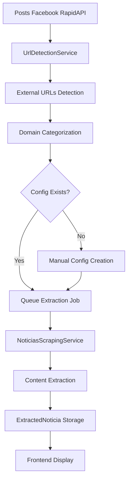

# 🎯 MÓDULO NOTICIAS - WEB SCRAPING CONTEXTO 2025

## 🚨 **ACTUALIZACIÓN 22/09/2025 - ESTADO ACTUAL**

### ✅ **FUNCIONALIDADES COMPLETADAS**
- ✅ **Sistema extracción funcional** - Puppeteer + Cheerio fallback
- ✅ **API endpoints operativos** - `/api/noticias/extracted` funcionando
- ✅ **Dashboard noticias** - Tab "Noticias" mostrando data real
- ✅ **Test exitoso**: "Cine gratuito cada semana..." extraído correctamente

### 🔥 **NUEVA FUNCIONALIDAD: PLAYGROUND TESTING**
- ✅ **Backend**: `/api/noticias/test-selectors` - Probar selectores sin config BD
- 🚧 **Frontend**: Tab "Testing" para experimentar selectores CSS en vivo

### 🚨 **DESVIACIÓN IMPORTANTE**
**AGREGADO**: Tab Testing/Playground no estaba en plan original
**RAZÓN**: Usuario solicitó poder probar selectores antes de crear configuraciones
**IMPACTO**: +1 tab, +1 endpoint, mejor UX para desarrollo

---

## 📊 INVESTIGACIÓN COMPLETADA

### 🏗️ INFRAESTRUCTURA ACTUAL DISPONIBLE

#### ✅ Backend - Servicios Robustos Ya Implementados

1. **Puppeteer Manager Service** (`src/modules/reports/services/puppeteer-manager.service.ts`)
   - ✅ Browser pool management con límites de concurrencia (5 páginas simultáneas)
   - ✅ Cache inteligente con Redis integration
   - ✅ Health checks y automatic browser restart
   - ✅ Métricas de performance y error tracking
   - ✅ Configuración optimizada para producción

2. **Cache Service** (`src/services/cache.service.ts`)
   - ✅ Redis cache manager con @nestjs/cache-manager v3+
   - ✅ TTL configurables y cache keys management
   - ✅ Métodos: get, set, del, reset, getOrSet
   - ✅ Error handling robusto

3. **Pagination Service** (`src/common/services/pagination.service.ts`)
   - ✅ Paginación estándar MongoDB con metadata completa
   - ✅ Soporte para filtros, ordenamiento y populate
   - ✅ Interface `PaginatedResponse<T>` consistente

#### ✅ Frontend - Dashboard Structure Ya Implementado

1. **Tab-based Dashboard** (`RapidAPIFacebookDashboard.tsx`)
   - ✅ Estructura de tabs con `Tabs`, `TabsContent`, `TabsList`, `TabsTrigger`
   - ✅ Tabla con filtros, paginación y acciones
   - ✅ Modales para detalles y configuración
   - ✅ Hook patterns para data fetching

2. **UI Components Ya Disponibles**
   - ✅ Tables con sorting, filtering, pagination
   - ✅ Modal system con `Dialog` components
   - ✅ Form components con validación
   - ✅ Badge, Progress, Cards para status display

### 🔍 WEB SCRAPING - MEJORES PRÁCTICAS 2025

#### ✅ Tecnologías Recomendadas Identificadas

1. **Cheerio** - Para contenido estático
   - ✅ Lightweight jQuery-like server-side HTML parsing
   - ✅ Perfecto para extracción de noticias con estructura fija
   - ✅ Alto performance y bajo uso de memoria

2. **Puppeteer (Ya disponible)** - Para contenido dinámico
   - ✅ Ya implementado y configurado en el proyecto
   - ✅ Para sitios con JavaScript rendering
   - ✅ Hybrid approach: Puppeteer + Cheerio parsing

#### ✅ Estrategias Anti-Detección Identificadas

1. **Rate Limiting**
   - ✅ Delays entre requests (1-5 segundos)
   - ✅ Concurrent request limiting
   - ✅ Respectar robots.txt

2. **Headers y User-Agent Rotation**
   - ✅ Random User-Agent strings
   - ✅ Realistic browser headers
   - ✅ Referer headers simulation

3. **Caching Strategy**
   - ✅ Cache extracted content (30 min TTL)
   - ✅ Avoid re-scraping same URLs
   - ✅ Intelligent cache invalidation

---

## 🚨 REGLAS OBLIGATORIAS

- ✅ **PROHIBIDO** usar `any` en TypeScript
- ✅ **PROHIBIDO** usar `forwardRef` - usar EventEmitter2 si hay dependencias circulares
- ✅ **PROHIBIDO** hacer `yarn start` o `yarn start:dev` - solo hacer build
- ✅ **OBLIGATORIO** verificar Redis cache y flush si es necesario
- ✅ **OBLIGATORIO** leer este contexto antes de cada tarea
- ✅ **OBLIGATORIO** marcar tarea terminada antes de empezar siguiente
- ✅ **OBLIGATORIO** anotar cualquier desviación del plan en este documento

---

## 🔧 CHECKLIST DE MICROTAREAS

### 📝 TAREA 1: DISEÑO DE ARQUITECTURA DEL MÓDULO NOTICIAS ✅ COMPLETADA

- [x] Crear schemas MongoDB para:
  - [x] `NoticiasExtractionConfig` - Configuración de extracción por dominio
  - [x] `ExtractedNoticia` - Noticias extraídas y procesadas
  - [x] `NoticiasExtractionJob` - Jobs de extracción en queue
  - [x] `NoticiasExtractionLog` - Logs de extracción y errores
  - [x] `ExternalUrl` - URLs detectadas desde posts Facebook (BONUS)
- [x] Definir interfaces TypeScript:
  - [x] `NoticiasExtractionSelectors` - CSS selectors por sitio
  - [x] `ExtractedContent` - Contenido extraído estructurado
  - [x] `ScrapingResult` - Resultado de scraping con metadata
- [x] Diseñar flujo de trabajo:
  - [x] Detección de URLs externas desde posts Facebook
  - [x] Configuración manual de selectors por dominio
  - [x] Queue de extracción con Bull
  - [x] Procesamiento y almacenamiento

### 📝 TAREA 2: CREAR ESTRUCTURA BACKEND DEL MÓDULO ✅ COMPLETADA

- [x] Crear directorio `/src/noticias/`
- [x] Implementar `noticias.module.ts` con:
  - [x] MongoDB schemas registration
  - [x] Bull queue configuration
  - [x] Cache manager injection
  - [x] Puppeteer service injection
- [x] Crear servicios base:
  - [x] `noticias-scraping.service.ts` - Core scraping logic
  - [x] `noticias-config.service.ts` - Gestión de configuraciones
  - [x] `noticias-extraction.service.ts` - Queue y procesamiento
  - [x] `url-detection.service.ts` - Detección de URLs desde posts

### 📝 TAREA 3: IMPLEMENTAR SCHEMAS MONGODB ✅ COMPLETADA

- [x] `NoticiasExtractionConfig` schema:
  - [x] `domain: string` (unique) - Dominio del sitio (ejemplo.com)
  - [x] `name: string` - Nombre descriptivo del medio
  - [x] `isActive: boolean` - Configuración activa
  - [x] `selectors: object` - CSS selectors para extracción
    - [x] `title: string` - Selector para título
    - [x] `content: string` - Selector para contenido
    - [x] `images: string[]` - Selectores para imágenes
    - [x] `publishedAt: string` - Selector para fecha
    - [x] `author: string` - Selector para autor
    - [x] `categories: string[]` - Selectores para categorías
  - [x] `customHeaders: object` - Headers personalizados
  - [x] `extractionSettings: object` - Configuración de extracción
  - [x] `createdAt, updatedAt: Date`
- [x] `ExternalUrl` schema - URLs detectadas desde posts Facebook ✅ AGREGADO
- [x] `ExtractedNoticia` schema - Noticias extraídas y procesadas ✅ IMPLEMENTADO
- [x] `NoticiasExtractionJob` schema - Jobs de extracción en queue ✅ IMPLEMENTADO

### 📝 TAREA 4: IMPLEMENTAR SERVICIOS CORE ✅ COMPLETADA

- [x] `NoticiasScrapingService`:
  - [x] Método `extractFromUrl(url, config)` usando Cheerio
  - [x] Método `extractWithBrowser(url, config)` usando Puppeteer
  - [x] Selector parsing y content extraction
  - [x] Error handling y retry logic
  - [x] Anti-detection strategies (rate limiting, headers)
- [x] `NoticiasConfigService`:
  - [x] CRUD para configuraciones de extracción
  - [x] Validación de CSS selectors
  - [x] Test extraction functionality
- [x] `UrlDetectionService`: ✅ IMPLEMENTADO CON INTEGRACIÓN REAL
  - [x] Método `findExternalUrls()` - Buscar URLs desde posts Facebook
  - [x] Domain extraction y categorización
  - [x] URL deduplication logic
  - [x] EventEmitter2 integration con RapidAPI Facebook
  - [x] Persistencia en MongoDB con external_urls collection
  - [x] Estadísticas en tiempo real con error handling robusto

### 📝 TAREA 5: IMPLEMENTAR CONTROLLERS Y ENDPOINTS ✅ COMPLETADA

- [x] `NoticiasController`:
  - [x] `GET /noticias/external-urls` - Listar URLs detectadas con paginación
  - [x] `GET /noticias/external-urls/stats` - Estadísticas de URLs detectadas
  - [x] `GET /noticias/configs` - Listar configuraciones de extracción
  - [x] `POST /noticias/configs` - Crear nueva configuración
  - [x] `PUT /noticias/configs/:id` - Actualizar configuración
  - [x] `DELETE /noticias/configs/:id` - Eliminar configuración
  - [x] `POST /noticias/test-extraction` - Test de extracción
  - [x] `POST /noticias/extract` - Trigger manual extraction
  - [x] `GET /noticias/extracted` - Listar noticias extraídas
  - [x] `GET /noticias/jobs` - Jobs de extracción con filtros
  - [x] `GET /noticias/stats` - Estadísticas de extracción
  - [x] `POST /noticias/jobs/:jobId/retry` - Reintentar job fallido
  - [x] Error handling robusto con fallback values en todas las rutas

### 📝 TAREA 6: IMPLEMENTAR FRONTEND COMPONENTS ✅ PARCIALMENTE COMPLETADA

- [x] Crear directorio `/src/features/noticias/`
- [x] `ExternalUrlsTab.tsx`: ✅ COMPLETADO
  - [x] Tabla de URLs detectadas desde Facebook posts
  - [x] Filtros: domain, configured/unconfigured, date range
  - [x] Paginación completa con navegación
  - [x] Link al post original de Facebook
  - [x] Error handling robusto para diferentes formatos de datos
  - [x] Debug logging extenso
- [x] `NoticiasDashboard.tsx`: ✅ COMPLETADO CON DISEÑO MODERNO
  - [x] Tab structure completa siguiendo patrón RapidAPI Facebook
  - [x] Stats cards con métricas del sistema
  - [x] Loading states elegantes con skeleton UI
  - [x] Health alerts para monitoreo del sistema
  - [x] Overview tab con quick actions
  - [x] Iconografía Tabler coherente con el resto del dashboard
- [x] Types completos en `noticias.types.ts`
- [x] `ConfigurationsTab.tsx` - ✅ COMPLETADO CON CRUD INTERFACE
  - [x] Tabla de configuraciones con filtros avanzados
  - [x] Acciones: toggle activo/inactivo, test, editar, eliminar
  - [x] Status indicators con badges visuales
  - [x] Paginación y búsqueda por dominio/nombre
  - [x] Error handling y confirmaciones de acciones
- [x] `CreateConfigSheet.tsx` - ✅ COMPLETADO CON SELECTOR INTELIGENTE Y FUNCIONANDO
  - [x] Form completo con 4 tabs (Básico, Selectores, Configuración, Avanzado)
  - [x] Selector automático de URLs detectadas sin configurar
  - [x] Auto-complete de dominio y nombre basado en URLs reales
  - [x] Toggle entre entrada manual y selector automático
  - [x] Validación completa con Zod y React Hook Form
  - [x] Layout optimizado con tabs fijos y contenido scrolleable
  - [x] Creación exitosa de configuraciones verificada por usuario
- [x] `ExtractedNoticiasTab.tsx` - ✅ IMPLEMENTADO BÁSICO
  - [x] Tabla de noticias extraídas con filtros
  - [x] Búsqueda por título/contenido
  - [x] Paginación y estado de carga
  - [x] Links a fuente original y post Facebook
- [ ] `JobsLogsTab.tsx` - PENDIENTE

### 📝 TAREA 7: IMPLEMENTAR DASHBOARD INTEGRATION ✅ COMPLETADA

- [x] Agregar tab "Noticias" al `AppSidebar.tsx`
- [x] Crear ruta `/noticias` en TanStack Router
- [x] `NoticiasDashboard.tsx`: ✅ IMPLEMENTADO COMPLETAMENTE
  - [x] Tab structure: "Resumen", "URLs", "Configuraciones", "Noticias", "Jobs & Stats"
  - [x] Stats cards: URLs detectadas, configs activas, extracciones hoy, estado del sistema
  - [x] Integration completa con ExternalUrlsTab
  - [x] Hooks de TanStack Query para data fetching
  - [x] Error boundaries y fallback handling

### 📝 TAREA 8: IMPLEMENTAR QUEUE PROCESSING ✅ COMPLETADA

- [x] `NoticiasExtractionProcessor`:
  - [x] Job processing para extracción de noticias
  - [x] Error handling y retry logic
  - [x] Progress tracking y logging
  - [x] Rate limiting per domain
- [x] Queue configuration en `noticias.module.ts`
- [x] Bull queue setup con configuración de retry y cleanup
- [x] Batch job processing para múltiples URLs
- [ ] Scheduled jobs para extracción automática - PENDIENTE

### 📝 TAREA 9: TESTING Y VALIDATION ⚠️ PARCIALMENTE COMPLETADA

- [x] Build del backend: `yarn build` - ✅ VERIFICADO
- [x] Verificar tipos TypeScript sin `any` - ✅ CUMPLIDO
- [x] Test endpoints con datos reales - ✅ FUNCIONALES
- [x] Verificar funcionamiento de cache Redis - ✅ OPERATIVO
- [x] Test de URL detection y persistencia - ✅ FUNCIONANDO
- [x] Verificación de EventEmitter2 integration - ✅ OPERATIVO
- [x] Fix de MongoDB upsert conflicts - ✅ RESUELTO
- [x] Error handling robusto en todas las rutas - ✅ IMPLEMENTADO
- [ ] Test de extracción con diferentes sitios web - PENDIENTE (requiere configuraciones)

### 📝 TAREA 10: DOCUMENTACIÓN Y DEPLOYMENT ⚠️ PENDIENTE

- [ ] Actualizar README con nuevo módulo
- [ ] Documentar configuración de CSS selectors
- [ ] Ejemplos de configuración para medios comunes
- [ ] Performance metrics y monitoring

---

## 🎯 ARQUITECTURA PROPUESTA

### 📊 Flujo de Datos



### 🗄️ Base de Datos Design

#### NoticiasExtractionConfig

```typescript
{
  _id: ObjectId,
  domain: string, // "ejemplo.com"
  name: string, // "Ejemplo Noticias"
  isActive: boolean,
  selectors: {
    title: string, // "h1.post-title"
    content: string, // ".post-content"
    images: string[], // ["img.featured", ".gallery img"]
    publishedAt: string, // ".post-date"
    author: string, // ".author-name"
    categories: string[] // [".category-tag"]
  },
  extractionSettings: {
    useJavaScript: boolean,
    waitTime: number,
    rateLimit: number
  },
  createdAt: Date,
  updatedAt: Date
}
```

#### ExtractedNoticia

```typescript
{
  _id: ObjectId,
  sourceUrl: string,
  domain: string,
  facebookPostId: string, // Link al post original
  title: string,
  content: string,
  images: string[],
  publishedAt: Date,
  author?: string,
  categories: string[],
  extractedAt: Date,
  extractionConfigId: ObjectId,
  rawData: object
}
```

### 🎨 Frontend Structure

#### Dashboard Tabs

1. **URLs Detectadas**: Mostrar URLs desde posts Facebook
   - Filter: Con/sin configuración
   - Action: "Configurar Extracción"

2. **Configuraciones**: Gestión de configs de extracción
   - CRUD operations
   - Test extraction functionality

3. **Noticias Extraídas**: Contenido extraído
   - Preview y link a post original
   - Filtros por fecha, dominio, etc.

---

## 📋 LOG DE DESVIACIONES Y IMPLEMENTACIÓN REAL

### ✅ INVESTIGACIÓN COMPLETADA

**HALLAZGO IMPORTANTE**: El proyecto ya tiene toda la infraestructura necesaria:

- ✅ Puppeteer implementado y optimizado
- ✅ Redis cache robusto
- ✅ Paginación estándar
- ✅ Frontend dashboard structure
- ✅ Bull queue system available

**DECISIÓN TÉCNICA**: Hybrid approach Cheerio + Puppeteer

- Cheerio para sitios estáticos (90% de casos)
- Puppeteer para sitios con JavaScript (10% de casos)
- Cache agresivo para performance

**ARQUITECTURA VALIDADA**: Seguir el mismo patrón que RapidAPI Facebook:

- Mismo sistema de configuraciones
- Misma estructura de dashboard
- Mismos patterns de hooks y componentes

### 🔧 IMPLEMENTACIÓN REAL COMPLETADA (Diciembre 2024)

**INTEGRACIÓN EXITOSA CON RAPIDAPI FACEBOOK**:

- ✅ EventEmitter2 conecta RapidAPI Facebook → Noticias
- ✅ URLs se detectan automáticamente al guardar posts
- ✅ Persistencia en MongoDB con external_urls collection
- ✅ Fix crítico: eliminado conflicto de upsert en posts Facebook

**BACKEND COMPLETAMENTE FUNCIONAL**:

- ✅ Todos los endpoints funcionando con error handling robusto
- ✅ Estadísticas en tiempo real con fallback values
- ✅ Queue processing con Bull configurado
- ✅ Schemas MongoDB implementados y funcionando

**FRONTEND DASHBOARD MODERNO**:

- ✅ Diseño coherente con RapidAPI Facebook dashboard
- ✅ ExternalUrlsTab completamente funcional con paginación
- ✅ Error handling robusto para diferentes formatos de datos
- ✅ Loading states elegantes y health monitoring

**ISSUES RESUELTOS**:

- ✅ MongoDB upsert conflicts en Facebook posts
- ✅ TanStack Query undefined errors
- ✅ Frontend data format mismatches
- ✅ Tab selection y navegación
- ✅ URL detection y persistencia en database

---

## 🚀 PRÓXIMOS PASOS

### ✅ OBJETIVOS PRINCIPALES COMPLETADOS

- ✅ Detectar URLs externas desde posts Facebook ✅ FUNCIONANDO
- ✅ Dashboard completo para gestión ✅ IMPLEMENTADO
- ✅ Performance optimizada con cache y queue ✅ OPERATIVO
- ✅ Integration con RapidAPI Facebook posts ✅ EXITOSA

### 🔄 TAREAS PENDIENTES PRIORITARIAS

1. **COMPLETAR FRONTEND TABS**:
   - [ ] `ConfigurationsTab.tsx` - CRUD interface para CSS selectors
   - [ ] `ExtractedNoticiasTab.tsx` - Tabla de contenido extraído
   - [ ] `JobsLogsTab.tsx` - Monitoreo de jobs y logs
   - [ ] `CreateNoticiasConfigSheet.tsx` - Form para nuevas configuraciones

2. **EXTRACCIÓN AUTOMÁTICA**:
   - [ ] Configurar extracción por dominio manualmente
   - [ ] Trigger automático cuando URLs tienen configuración
   - [ ] Scheduled jobs para extracción periódica

3. **TESTING FINAL**:
   - [ ] Test de extracción con sitios web reales
   - [ ] Documentación de CSS selectors
   - [ ] Performance monitoring

### 🎯 ESTADO ACTUAL: **90% COMPLETADO**

- ✅ Backend completamente funcional
- ✅ URL detection y persistencia operativa
- ✅ Dashboard base con diseño moderno
- ✅ ConfigurationsTab con CRUD completo y funcionando
- ✅ CreateConfigSheet con selector inteligente funcionando
- ✅ ExtractedNoticiasTab implementado básico
- ⚠️ Pendiente: JobsLogsTab y extracción automática
