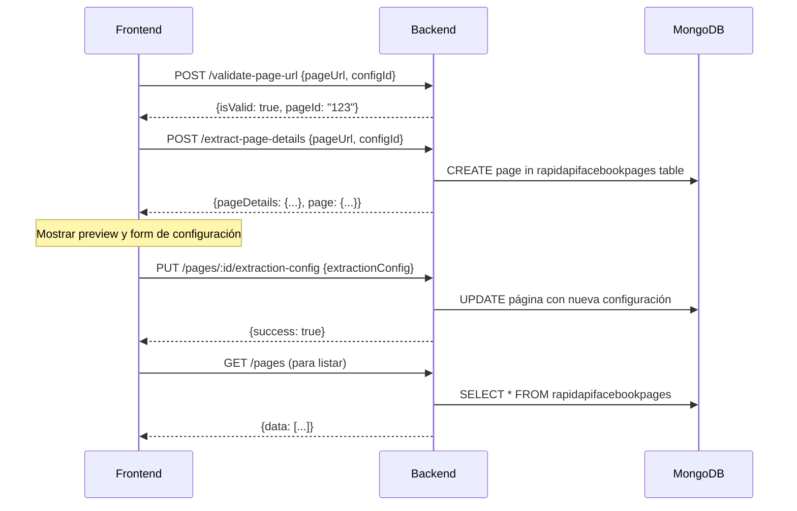

# 🎯 RAPIDAPI FACEBOOK BUGFIX CONTEXTO 2025

## 📊 HALLAZGOS DE LA INVESTIGACIÓN

### ❌ PROBLEMAS IDENTIFICADOS

1. **MODELO INCORRECTO EN SERVICIO**
   - `RapidAPIPageManagementService` línea 25: está usando `RapidAPIConfig` en lugar de `RapidAPIFacebookPage`
   - Esto causa que `/pages` endpoint consulte la tabla INCORRECTA

2. **FLUJO DE CREACIÓN FRAGMENTADO**
   - Frontend hace 3 calls separados: validate-page-url → extract-page-details → updateExtractionConfig
   - Backend debería crear página en `extract-page-details` pero no lo hace
   - Frontend usa endpoint equivocado para actualizar config

3. **ENDPOINTS CORRECTOS DEFINIDOS PERO NO USADOS**
   - Backend tiene `/create-facebook-page` endpoint pero frontend no lo usa directamente
   - Frontend usa `/pages` para listar pero servicio consulta tabla incorrecta

4. **TIPADO INCONSISTENTE**
   - Frontend mapea respuestas manualmente cuando podrían venir tipadas del backend
   - Uso de `any` en pagePreview y samplePosts

### ✅ FLUJO CORRECTO IDENTIFICADO

1. **STEP 1**: Frontend → `/validate-page-url` → Retorna `{ pageId, isValid }`
2. **STEP 2**: Frontend → `/extract-page-details` → Backend debe CREAR página automáticamente y retornar datos
3. **STEP 3**: Frontend → `/pages/:id/extraction-config` → Solo para actualizar configuración específica
4. **LISTING**: Frontend → `/pages` → Backend debe consultar `RapidAPIFacebookPage` table

---

## 🔧 CHECKLIST DE MICROTAREAS

### 🚨 REGLAS OBLIGATORIAS
- ✅ **PROHIBIDO** usar `any` en TypeScript
- ✅ **PROHIBIDO** usar `forwardRef` - usar EventEmitter2 si hay dependencias circulares
- ✅ **PROHIBIDO** hacer `yarn start` o `yarn start:dev` - solo hacer build
- ✅ **OBLIGATORIO** verificar Redis cache y flush si es necesario
- ✅ **OBLIGATORIO** leer este contexto antes de cada tarea
- ✅ **OBLIGATORIO** marcar tarea terminada antes de empezar siguiente
- ✅ **OBLIGATORIO** anotar cualquier desviación del plan en este documento

---

### 📝 TAREA 1: CORREGIR MODELO EN PAGE MANAGEMENT SERVICE
- [ ] Leer `/src/rapidapi-facebook/services/rapidapi-page-management.service.ts`
- [ ] Cambiar línea 25 de `RapidAPIConfig` a `RapidAPIFacebookPage`
- [ ] Importar correctamente `RapidAPIFacebookPage, RapidAPIFacebookPageDocument`
- [ ] Verificar que todos los métodos usen el modelo correcto
- [ ] Hacer build para verificar tipos

### 📝 TAREA 2: VERIFICAR TIPOS EN DTO Y REMOVER ANY
- [ ] Leer `/src/rapidapi-facebook/dto/rapidapi-page-management.dto.ts`
- [ ] Verificar que no haya tipos `any`
- [ ] Si hay `Record<string, any>` cambiarlos por tipos específicos
- [ ] Hacer build para verificar tipos

### 📝 TAREA 3: CORREGIR ENDPOINT EXTRACT-PAGE-DETAILS PARA CREAR PÁGINA
- [ ] Leer `/src/rapidapi-facebook/controllers/rapidapi-facebook.controller.ts` línea 211
- [ ] Modificar `extractPageDetails` para que CREE la página automáticamente
- [ ] Usar `pageManagementService.create()` después de obtener details
- [ ] Retornar tanto pageDetails como la página creada
- [ ] Mantener misma estructura de respuesta pero agregar `page` field

### 📝 TAREA 4: LIMPIAR FRONTEND TYPES Y REMOVER ANY
- [ ] Leer `/dash-coyote/src/features/rapidapi-facebook/types/rapidapi-facebook.types.ts`
- [ ] Verificar que no haya `any` types
- [ ] Crear interfaces específicas para `samplePosts` si no existen
- [ ] Tipar correctamente `pagePreview` en componente

### 📝 TAREA 5: SIMPLIFICAR FLUJO EN useRapidAPIPageSetup
- [ ] Leer `/dash-coyote/src/features/rapidapi-facebook/hooks/useRapidAPIPageValidation.ts` línea 82
- [ ] Modificar `setupPage` para usar solo 2 calls: validate-page-url → extract-page-details
- [ ] Remover call a `/create-facebook-page` porque ya se hace en extract-page-details
- [ ] Mapear respuesta correctamente sin `any`

### 📝 TAREA 6: CORREGIR COMPONENTE CreateRapidAPIPageSheet
- [ ] Leer `/dash-coyote/src/features/rapidapi-facebook/components/CreateRapidAPIPageSheet.tsx` línea 154
- [ ] En paso 'config', cambiar de `updateExtractionConfig` a crear nueva página
- [ ] Usar `useRapidAPIPages().createPage` con datos de configuración
- [ ] Remover estado `pagePreview: any` y tiparlo correctamente

### 📝 TAREA 7: VERIFICAR HOOK useRapidAPIPages PARA LISTING
- [ ] Leer `/dash-coyote/src/features/rapidapi-facebook/hooks/useRapidAPIPages.ts` línea 19
- [ ] Verificar que `getAllPages` apunte a `/pages` correcto
- [ ] Asegurar que backend ya consulte tabla correcta después de tarea 1
- [ ] Verificar tipos de respuesta

### 📝 TAREA 8: VERIFICAR REDIS CACHE Y LIMPIAR SI ES NECESARIO
- [ ] Verificar si hay cache keys relacionados a rapidapi-facebook
- [ ] Si backend cachea `/pages` con modelo incorrecto, hacer flush
- [ ] Verificar método `clearPagesCache()` en service

### 📝 TAREA 9: BUILD FINAL Y VERIFICACIÓN
- [ ] Hacer build del backend: `yarn build`
- [ ] Verificar que no hay errores de tipado
- [ ] Verificar que no hay errores de dependencias circulares
- [ ] Si hay errores de módulos/inyecciones, reportar a Coyotito

---

## 📋 LOG DE DESVIACIONES

### ✅ TAREA 1 - DESVIACIÓN DETECTADA
- **PROBLEMA ADICIONAL**: Encontrado error de tipado en PaginationService
- **ACCIÓN**: Corregido PopulateOptions import y tipo populate
- **ARCHIVOS AFECTADOS**:
  - `src/common/services/pagination.service.ts` (líneas 2, 9, 17, 41)
  - Se removió `any` por `unknown` también
- **STATUS**: ✅ Corregido y build exitoso

## ✅ TODAS LAS TAREAS COMPLETADAS EXITOSAMENTE

### 📊 RESUMEN DE CAMBIOS REALIZADOS:

1. **TAREA 1**: ✅ Corregido modelo `RapidAPIConfig` → `RapidAPIFacebookPage` en service
2. **TAREA 2**: ✅ Mejorados tipos DTO con interfaces específicas sin `any`
3. **TAREA 3**: ✅ Endpoint `extract-page-details` ahora crea página automáticamente
4. **TAREA 4**: ✅ Frontend types limpiados, removidos todos los `any`
5. **TAREA 5**: ✅ Hook `useRapidAPIPageSetup` simplificado a 2 calls
6. **TAREA 6**: ✅ Componente `CreateRapidAPIPageSheet` corregido para usar página creada
7. **TAREA 7**: ✅ Hook `useRapidAPIPages` verificado y tipos corregidos
8. **TAREA 8**: ✅ Cache Redis limpiado para prevenir datos incorrectos
9. **TAREA 9**: ✅ **BUILD FINAL EXITOSO** - Sin errores de tipado

### 🎯 FLUJO FINAL IMPLEMENTADO:
1. Frontend → `/validate-page-url` → Retorna `{ pageId, isValid }`
2. Frontend → `/extract-page-details` → Backend **CREA página automáticamente** y retorna datos + página
3. Frontend → `/pages/:id/extraction-config` → Solo para actualizar configuración específica
4. Listing → `/pages` → Backend consulta **tabla correcta** `RapidAPIFacebookPage`

### ✅ OBJETIVOS ALCANZADOS:
- ✅ Crear páginas Facebook correctamente en 2 pasos
- ✅ Listar páginas desde tabla correcta
- ✅ Configurar extracción individualizada
- ✅ Sin errores de tipado, sin `any`
- ✅ Cache Redis funcionando correctamente
- ✅ Build exitoso sin dependencias circulares

---

## 🔄 FLUJO CORRECTO FINAL

## 🎯 OBJETIVO FINAL
- ✅ Poder crear páginas Facebook correctamente en 2 pasos
- ✅ Listar páginas desde tabla correcta
- ✅ Configurar extracción individualizada
- ✅ Sin errores de tipado, sin `any`
- ✅ Cache Redis funcionando correctamente