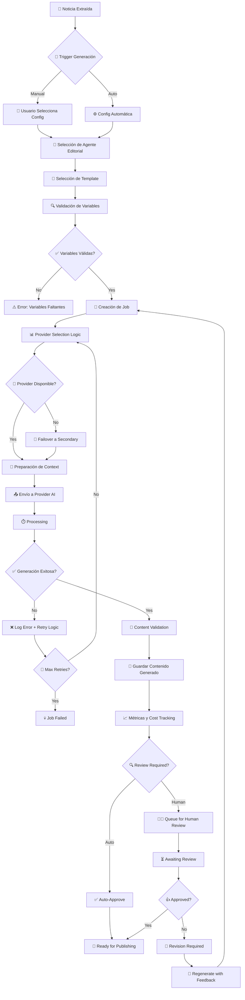

# 🔄 DISEÑO DE FLUJO DE TRABAJO - CONTENT AI GENERATION

## 📋 **FLUJO PRINCIPAL: NOTICIA → CONTENIDO GENERADO**



## 🏗️ **COMPONENTES DEL FLUJO**

### 1. **🎯 SELECCIÓN DE AGENTE EDITORIAL**

**Input**:
- Noticia original (`ExtractedNoticia`)
- Criterios de selección (manual/automático)

**Lógica de Selección**:
```typescript
interface AgentSelectionCriteria {
  contentCategory?: string; // "política", "deportes", "sociedad"
  desiredTone?: 'conservative' | 'progressive' | 'neutral' | 'humor';
  targetAudience?: 'general' | 'specialized' | 'youth';
  urgency?: 'low' | 'medium' | 'high';
}

interface AgentSelectionResult {
  selectedAgent: ContentAgent;
  confidence: number; // 0-100%
  alternatives: ContentAgent[];
  selectionReason: string;
}
```

**Algoritmo**:
1. Analizar categoría del contenido original
2. Matching con especializations del agente
3. Considerar performance metrics histórico
4. Aplicar priority weights
5. Retornar agente óptimo + alternativas

### 2. **📝 SELECCIÓN DE TEMPLATE**

**Input**:
- Agente seleccionado
- Tipo de contenido deseado
- Variables disponibles

**Lógica**:
```typescript
interface TemplateSelectionCriteria {
  agentId: string;
  contentType: ContentType;
  availableVariables: string[];
  providerId?: string; // Para compatibilidad
}

interface TemplateSelectionResult {
  selectedTemplate: PromptTemplate;
  missingVariables: string[];
  qualityScore: number;
  estimatedCost: number;
}
```

### 3. **🏥 PROVIDER SELECTION LOGIC**

**Input**:
- Template seleccionado
- Cost constraints
- Performance requirements

**Algoritmo de Selección**:
```typescript
interface ProviderSelectionStrategy {
  strategy: 'cost-optimized' | 'performance-optimized' | 'balanced' | 'specific';
  maxCostPerToken?: number;
  maxLatencyMs?: number;
  preferredProviders?: string[];
  fallbackProviders?: string[];
}

interface ProviderSelectionResult {
  primaryProvider: AIProvider;
  fallbackProviders: AIProvider[];
  estimatedCost: number;
  estimatedLatency: number;
  confidenceScore: number;
}
```

**Scoring Formula**:
```typescript
providerScore = (
  healthScore * 0.3 +
  performanceScore * 0.25 +
  costScore * 0.2 +
  compatibilityScore * 0.15 +
  priorityScore * 0.1
) * availabilityMultiplier
```

### 4. **🎨 PREPARACIÓN DE CONTEXTO**

**Process**:
1. Extract variables from original content
2. Apply template variable mapping
3. Inject agent persona and system prompt
4. Format according to provider API
5. Add metadata for tracking

```typescript
interface ContextPreparation {
  originalContent: ExtractedNoticia;
  template: PromptTemplate;
  agent: ContentAgent;
  provider: AIProvider;
}

interface PreparedContext {
  systemPrompt: string;
  userPrompt: string;
  parameters: {
    temperature: number;
    maxTokens: number;
    topP?: number;
    frequencyPenalty?: number;
    presencePenalty?: number;
  };
  metadata: {
    jobId: string;
    correlationId: string;
    timestamp: Date;
  };
}
```

### 5. **🔄 RETRY LOGIC & FAILOVER**

**Retry Strategy**:
```typescript
interface RetryConfiguration {
  maxRetries: number; // Default: 3
  backoffStrategy: 'linear' | 'exponential' | 'custom';
  baseDelayMs: number; // Default: 1000
  maxDelayMs: number; // Default: 30000
  retryableErrors: string[]; // HTTP codes, error types
}

interface FailoverStrategy {
  enabled: boolean;
  fallbackProviders: string[];
  autoFailover: boolean;
  failoverThresholdMs: number; // Timeout antes de failover
}
```

**Algoritmo**:
1. Attempt primary provider
2. If error → check if retryable
3. If retryable → apply backoff delay → retry
4. If max retries reached → trigger failover
5. Attempt fallback provider
6. Log all attempts for analysis

### 6. **📄 CONTENT VALIDATION**

**Validation Layers**:
```typescript
interface ContentValidation {
  structuralValidation: {
    hasTitle: boolean;
    hasContent: boolean;
    minimumLength: number;
    maximumLength: number;
  };
  qualityValidation: {
    readabilityScore: number;
    coherenceScore: number;
    originalityScore: number;
  };
  safetyValidation: {
    toxicityScore: number;
    biasScore: number;
    factualAccuracy: number;
  };
  seoValidation: {
    keywordDensity: number;
    metaCompliance: boolean;
    headingStructure: boolean;
  };
}
```

### 7. **📈 MÉTRICAS Y COST TRACKING**

**Tracked Metrics**:
```typescript
interface GenerationMetrics {
  performance: {
    totalProcessingTime: number;
    queueWaitTime: number;
    apiLatency: number;
    throughputTokensPerSecond: number;
  };
  cost: {
    promptTokens: number;
    completionTokens: number;
    totalCost: number;
    costPerToken: number;
  };
  quality: {
    userRating?: number;
    automaticQualityScore: number;
    humanReviewScore?: number;
  };
  usage: {
    retryCount: number;
    failoverCount: number;
    providerUsed: string;
    templateUsed: string;
    agentUsed: string;
  };
}
```

## 🚨 **CASOS DE ERROR Y MANEJO**

### **Error Types & Handling**:

| Error Type | Retry | Failover | User Action |
|------------|-------|----------|-------------|
| `RATE_LIMIT_EXCEEDED` | ✅ Yes | ✅ Yes | Queue delay |
| `INSUFFICIENT_CREDITS` | ❌ No | ✅ Yes | Payment required |
| `MODEL_OVERLOADED` | ✅ Yes | ✅ Yes | Auto-retry |
| `CONTENT_FILTERED` | ❌ No | ⚠️ Maybe | Manual review |
| `INVALID_REQUEST` | ❌ No | ❌ No | Fix input |
| `NETWORK_ERROR` | ✅ Yes | ✅ Yes | Auto-retry |
| `TIMEOUT` | ✅ Yes | ✅ Yes | Auto-retry |

### **Circuit Breaker Pattern**:
```typescript
interface CircuitBreakerConfig {
  failureThreshold: number; // Default: 5
  timeoutMs: number; // Default: 30000
  resetTimeoutMs: number; // Default: 60000
}

type CircuitState = 'CLOSED' | 'OPEN' | 'HALF_OPEN';
```

## 📊 **MONITOREO Y ALERTAS**

### **Key Performance Indicators (KPIs)**:
- Success Rate por provider
- Average latency por template
- Cost per generated article
- Quality score trends
- User satisfaction ratings

### **Alertas Automáticas**:
- Provider health degradation
- Cost threshold exceeded
- Quality score below minimum
- High error rate detected
- Processing queue backup

## 🔒 **SEGURIDAD Y COMPLIANCE**

### **Data Protection**:
- Encriptación de API keys
- Audit logs completos
- PII detection y masking
- Content filtering obligatorio

### **Rate Limiting**:
- Per-user limits
- Per-provider limits
- Cost-based throttling
- Priority queue management

---

## ✅ **IMPLEMENTACIÓN COMPLETADA**

- ✅ **Schemas MongoDB**: 6 schemas creados con índices optimizados
- ✅ **Interfaces TypeScript**: 4 interfaces principales + tipos auxiliares
- ✅ **Workflow Design**: Flujo completo documentado con error handling
- ✅ **Build Verification**: Sin errores TypeScript

**ESTADO**: Arquitectura base del módulo AI Content Generation completada.
**SIGUIENTE**: Implementar adapters y servicios core (Tarea 2).