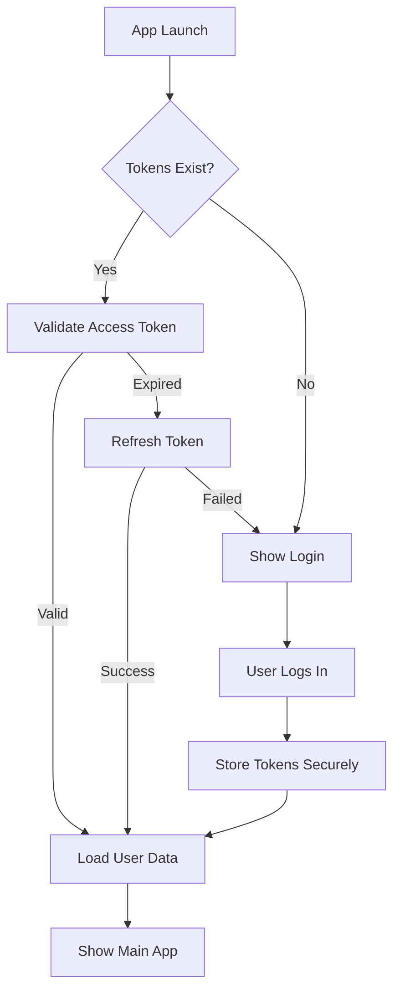

# 🎯 Guía de Buenas Prácticas - Expo Mobile App 2025

## 📱 ARQUITECTURA GENERAL

### 🏗️ Estructura de Carpetas
```
src/
├── components/           # Componentes reutilizables
│   ├── ui/              # UI primitivos (Button, Input, etc)
│   ├── forms/           # Componentes de formularios
│   ├── layout/          # Layout components (Header, TabBar)
│   └── shared/          # Componentes compartidos específicos
├── features/            # Features por dominio
│   ├── auth/           # Sistema de autenticación
│   │   ├── components/ # Componentes específicos de auth
│   │   ├── hooks/      # Hooks personalizados de auth
│   │   ├── services/   # Servicios HTTP y lógica
│   │   ├── stores/     # Estado Zustand
│   │   ├── types/      # Tipos TypeScript
│   │   └── utils/      # Utilidades específicas
│   ├── news/           # Feature de noticias
│   └── analytics/      # Feature de analytics
├── hooks/              # Hooks globales reutilizables
├── services/           # Servicios HTTP y APIs
│   ├── api/           # Configuración de API clients
│   ├── auth/          # Servicios de autenticación
│   └── storage/       # Servicios de almacenamiento
├── stores/            # Estado global Zustand
├── types/             # Tipos TypeScript globales
├── utils/             # Utilidades y helpers globales
├── constants/         # Constantes de la aplicación
└── config/            # Configuración de la app
```

---

## 🔒 GESTIÓN DE ESTADO UNIFICADA

### 🎯 Patrón TanStack Query + Zustand (2025)

#### **Para Estado del Servidor (TanStack Query)**
```typescript
// ✅ CORRECTO - Queries para datos del servidor
const useNewsQuery = () => useQuery({
  queryKey: ['news', { page: 1 }],
  queryFn: () => newsService.getNews({ page: 1 }),
  staleTime: 5 * 60 * 1000, // 5 minutos
})

// ✅ CORRECTO - Mutations para cambios del servidor
const useLoginMutation = () => useMutation({
  mutationFn: authService.login,
  onSuccess: (data) => {
    authStore.getState().setTokens(data.tokens)
    queryClient.invalidateQueries({ queryKey: ['user'] })
  }
})
```

#### **Para Estado Cliente (Zustand)**
```typescript
// ✅ CORRECTO - Estado de UI y aplicación
interface AppStore {
  theme: 'light' | 'dark'
  language: string
  isFirstLaunch: boolean
  setTheme: (theme: 'light' | 'dark') => void
}

// ✅ CORRECTO - Estado de autenticación
interface AuthStore {
  tokens: Tokens | null
  user: User | null
  isAuthenticated: boolean
  setTokens: (tokens: Tokens) => void
  logout: () => void
}
```

---

## 🔐 SISTEMA DE AUTENTICACIÓN SEGURO

### 🛡️ Almacenamiento Seguro (2025)

#### **Jerarquía de Seguridad**
```typescript
// 🔒 NIVEL 1 - Datos Ultra Sensibles (Expo SecureStore)
await SecureStore.setItemAsync('refreshToken', token, {
  requireAuthentication: true, // Requiere biometría/PIN
  authenticationPrompt: 'Authenticate to access your account'
})

// 🔐 NIVEL 2 - Datos Sensibles (Encrypted AsyncStorage)
await EncryptedStorage.setItem('accessToken', token)

// 📦 NIVEL 3 - Datos Normales (AsyncStorage)
await AsyncStorage.setItem('userPreferences', JSON.stringify(prefs))

// 💾 NIVEL 4 - Datos Cache (En memoria/TanStack Query)
// Solo durante la sesión activa
```

#### **Configuración de Tokens**
```typescript
interface TokenConfig {
  accessToken: {
    storage: 'encrypted'  // EncryptedStorage
    duration: '15m'       // 15 minutos
    autoRefresh: true
  }
  refreshToken: {
    storage: 'secure'     // SecureStore + biometría
    duration: '7d'        // 7 días
    requireAuth: true
  }
}
```

---

## 🌐 CLIENTE HTTP ROBUSTO

### ⚡ Configuración Axios + Interceptors
```typescript
// ✅ PATRÓN 2025 - Cliente HTTP con auto-refresh
class ApiClient {
  private client: AxiosInstance
  private refreshPromise: Promise<string> | null = null

  constructor() {
    this.client = axios.create({
      baseURL: Config.API_BASE_URL,
      timeout: 10000,
      headers: { 'x-platform': 'mobile' }
    })

    this.setupInterceptors()
  }

  private setupInterceptors() {
    // Request interceptor - Agregar token
    this.client.interceptors.request.use(async (config) => {
      const token = await TokenManager.getAccessToken()
      if (token) {
        config.headers.Authorization = `Bearer ${token}`
      }
      return config
    })

    // Response interceptor - Auto-refresh en 401
    this.client.interceptors.response.use(
      (response) => response,
      async (error) => {
        if (error.response?.status === 401) {
          return this.handleTokenRefresh(error)
        }
        return Promise.reject(error)
      }
    )
  }

  private async handleTokenRefresh(originalError: AxiosError) {
    // Solo un refresh simultáneo
    if (!this.refreshPromise) {
      this.refreshPromise = TokenManager.refreshToken()
    }

    try {
      await this.refreshPromise
      // Reintentar request original
      return this.client.request(originalError.config!)
    } catch {
      authStore.getState().logout()
      throw originalError
    } finally {
      this.refreshPromise = null
    }
  }
}
```

---

## 📊 MAPPERS Y TRANSFORMACIONES

### 🔄 Patrón de Mappers Tipados
```typescript
// ✅ PATRÓN - Separar tipos API vs App
namespace API {
  interface User {
    id: string
    username: string
    email: string
    first_name: string  // snake_case del backend
    last_name: string
    created_at: string
  }
}

namespace App {
  interface User {
    id: string
    username: string
    email: string
    firstName: string   // camelCase para la app
    lastName: string
    createdAt: Date
  }
}

// ✅ MAPPER bidireccional
class UserMapper {
  static toApp(apiUser: API.User): App.User {
    return {
      id: apiUser.id,
      username: apiUser.username,
      email: apiUser.email,
      firstName: apiUser.first_name,
      lastName: apiUser.last_name,
      createdAt: new Date(apiUser.created_at)
    }
  }

  static toAPI(appUser: App.User): API.User {
    return {
      id: appUser.id,
      username: appUser.username,
      email: appUser.email,
      first_name: appUser.firstName,
      last_name: appUser.lastName,
      created_at: appUser.createdAt.toISOString()
    }
  }
}
```

---

## 🎣 HOOKS PERSONALIZADOS

### 📱 Hooks de Autenticación
```typescript
// ✅ HOOK - Autenticación completa
export const useAuth = () => {
  const store = useAuthStore()
  const queryClient = useQueryClient()

  const login = useMutation({
    mutationFn: (credentials: LoginRequest) =>
      authService.login(credentials),
    onSuccess: async (response) => {
      await TokenManager.setTokens(response.tokens)
      store.setUser(UserMapper.toApp(response.user))
      queryClient.invalidateQueries({ queryKey: ['user'] })
    }
  })

  const logout = useCallback(async () => {
    try {
      await authService.logout()
    } finally {
      await TokenManager.clearTokens()
      store.reset()
      queryClient.clear()
    }
  }, [store, queryClient])

  return {
    user: store.user,
    isAuthenticated: store.isAuthenticated,
    isLoading: login.isPending,
    login: login.mutate,
    logout,
    error: login.error
  }
}
```

### 🔐 Hook de Autenticación Biométrica
```typescript
// ✅ HOOK - Biometría integrada
export const useBiometricAuth = () => {
  const [isSupported, setIsSupported] = useState(false)
  const [isEnrolled, setIsEnrolled] = useState(false)

  useEffect(() => {
    LocalAuthentication.hasHardwareAsync().then(setIsSupported)
    LocalAuthentication.isEnrolledAsync().then(setIsEnrolled)
  }, [])

  const authenticate = useCallback(async (): Promise<boolean> => {
    if (!isSupported || !isEnrolled) return false

    const result = await LocalAuthentication.authenticateAsync({
      promptMessage: 'Authenticate to access your account',
      cancelLabel: 'Use Password',
      fallbackLabel: 'Use Passcode'
    })

    return result.success
  }, [isSupported, isEnrolled])

  return {
    isSupported,
    isEnrolled,
    authenticate,
    canUseBiometrics: isSupported && isEnrolled
  }
}
```

---

## 📱 SERVICIOS ESPECIALIZADOS

### 🔧 Servicio de Autenticación
```typescript
// ✅ SERVICIO - Auth con manejo robusto
export class AuthService {
  private apiClient: ApiClient

  async login(credentials: LoginRequest): Promise<LoginResponse> {
    const deviceInfo = await DeviceInfoService.collect()

    const response = await this.apiClient.post('/auth/login', {
      ...credentials,
      deviceId: deviceInfo.deviceId,
      platform: 'mobile'
    })

    return AuthResponseMapper.toApp(response.data)
  }

  async refreshToken(): Promise<TokenPair> {
    const refreshToken = await TokenManager.getRefreshToken()
    if (!refreshToken) throw new Error('No refresh token')

    const response = await this.apiClient.post('/auth/refresh', {
      refreshToken
    })

    return TokenMapper.toApp(response.data)
  }

  async logout(allDevices = false): Promise<void> {
    try {
      await this.apiClient.post('/auth/logout', { allDevices })
    } catch (error) {
      // Log pero no fallar - limpiar estado local siempre
      console.warn('Logout API failed:', error)
    }
  }
}
```

### 💾 Gestor de Tokens Seguro
```typescript
// ✅ SERVICIO - Token Manager con encriptación
export class TokenManager {
  private static readonly ACCESS_TOKEN_KEY = 'access_token'
  private static readonly REFRESH_TOKEN_KEY = 'refresh_token'

  static async setTokens(tokens: TokenPair): Promise<void> {
    await Promise.all([
      // Access token - encriptado en AsyncStorage
      EncryptedStorage.setItem(
        this.ACCESS_TOKEN_KEY,
        tokens.accessToken
      ),
      // Refresh token - SecureStore con biometría
      SecureStore.setItemAsync(
        this.REFRESH_TOKEN_KEY,
        tokens.refreshToken,
        { requireAuthentication: true }
      )
    ])
  }

  static async getAccessToken(): Promise<string | null> {
    try {
      return await EncryptedStorage.getItem(this.ACCESS_TOKEN_KEY)
    } catch {
      return null
    }
  }

  static async getRefreshToken(): Promise<string | null> {
    try {
      return await SecureStore.getItemAsync(this.REFRESH_TOKEN_KEY)
    } catch {
      return null
    }
  }

  static async clearTokens(): Promise<void> {
    await Promise.all([
      EncryptedStorage.removeItem(this.ACCESS_TOKEN_KEY),
      SecureStore.deleteItemAsync(this.REFRESH_TOKEN_KEY)
    ])
  }

  static async isTokenValid(token: string): Promise<boolean> {
    try {
      const payload = JSON.parse(atob(token.split('.')[1]))
      return payload.exp * 1000 > Date.now()
    } catch {
      return false
    }
  }
}
```

---

## ⚡ OPTIMIZACIONES DE PERFORMANCE

### 🚀 Configuración TanStack Query
```typescript
// ✅ CONFIGURACIÓN - Optimizada para mobile
export const queryClient = new QueryClient({
  defaultOptions: {
    queries: {
      staleTime: 5 * 60 * 1000,     // 5 minutos
      gcTime: 10 * 60 * 1000,      // 10 minutos (antes cacheTime)
      retry: (failureCount, error) => {
        // No retry en errores de auth
        if (error?.response?.status === 401) return false
        return failureCount < 3
      },
      retryDelay: attemptIndex => Math.min(1000 * 2 ** attemptIndex, 30000)
    },
    mutations: {
      retry: 1,
      retryDelay: 1000
    }
  }
})
```

### 🎯 Query Keys Estandarizadas
```typescript
// ✅ PATRÓN - Query Keys consistentes
export const queryKeys = {
  // Feature-based grouping
  auth: {
    all: ['auth'] as const,
    user: () => [...queryKeys.auth.all, 'user'] as const,
    profile: () => [...queryKeys.auth.all, 'profile'] as const
  },
  news: {
    all: ['news'] as const,
    lists: () => [...queryKeys.news.all, 'list'] as const,
    list: (filters: NewsFilters) => [...queryKeys.news.lists(), filters] as const,
    detail: (id: string) => [...queryKeys.news.all, 'detail', id] as const
  }
} as const
```

---

## 🔧 CONFIGURACIÓN EXPO

### 📦 Dependencias Esenciales 2025
```json
{
  "dependencies": {
    "@tanstack/react-query": "^5.89.0",
    "zustand": "^4.5.0",
    "axios": "^1.12.2",

    "expo-secure-store": "^13.0.1",
    "expo-local-authentication": "^14.0.1",
    "react-native-encrypted-storage": "^4.0.3",

    "@react-native-async-storage/async-storage": "^2.2.0",
    "expo-device": "^8.0.7",
    "expo-application": "^7.0.7",
    "expo-network": "^8.0.7"
  }
}
```

### ⚙️ App.config.js Optimizado
```javascript
export default {
  expo: {
    name: "Noticias Pachuca",
    slug: "noticias-pachuca-mobile",
    version: "1.0.0",
    orientation: "portrait",

    // Security
    privacy: "unlisted",

    // Performance
    assetBundlePatterns: ["**/*"],

    // Platform specific
    ios: {
      supportsTablet: false,
      requireFullScreen: true,
      bundleIdentifier: "com.noticiaspachuca.mobile"
    },
    android: {
      package: "com.noticiaspachuca.mobile",
      versionCode: 1,
      permissions: [
        "USE_BIOMETRIC",
        "USE_FINGERPRINT",
        "INTERNET",
        "ACCESS_NETWORK_STATE"
      ]
    }
  }
}
```

---

## 🧪 TESTING STRATEGY

### 🎯 Estructura de Tests
```
__tests__/
├── components/          # Tests de componentes
├── hooks/              # Tests de hooks personalizados
├── services/           # Tests de servicios
├── stores/             # Tests de estado Zustand
├── utils/              # Tests de utilidades
└── __mocks__/          # Mocks globales
```

### ✅ Test Patterns
```typescript
// ✅ TEST - Hook de autenticación
describe('useAuth', () => {
  beforeEach(() => {
    queryClient.clear()
    authStore.getState().reset()
  })

  it('should login successfully', async () => {
    const mockUser = createMockUser()
    mockAuthService.login.mockResolvedValue(mockUser)

    const { result } = renderHook(() => useAuth(), {
      wrapper: createTestWrapper()
    })

    act(() => {
      result.current.login({ email: 'test@test.com', password: 'password' })
    })

    await waitFor(() => {
      expect(result.current.user).toEqual(mockUser)
      expect(result.current.isAuthenticated).toBe(true)
    })
  })
})
```

---

## 🎯 MEJORES PRÁCTICAS GENERALES

### ✅ DO's (Hacer)
- **Tipado estricto**: Usar TypeScript sin `any`
- **Separación de responsabilidades**: Feature-based architecture
- **Seguridad primero**: SecureStore para datos sensibles
- **Performance**: Lazy loading y code splitting
- **Offline-first**: Implementar cache y sincronización
- **Accesibilidad**: WCAG 2.1 AA compliance
- **Testing**: Unit tests + Integration tests

### ❌ DON'Ts (No hacer)
- **Nunca** almacenar tokens en AsyncStorage plano
- **Nunca** hacer llamadas API directas desde componentes
- **Nunca** usar estado global para datos del servidor
- **Nunca** hardcodear URLs o configuraciones
- **Nunca** ignorar los errores de autenticación
- **Nunca** hacer fetch sin manejo de errores

### 🔄 Flujo de Autenticación Completo


---

*🎯 CONTEXTO: Expo Mobile Best Practices 2025 | Listo, Coyotito. ¿Implementamos el sistema de auth?*